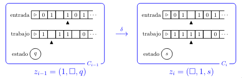

# Complejidad Computacional — Clase 5

## Mini-configuración

Consideremos una máquina determinística $M = (\Sigma, Q, \delta)$:
- Sin cinta de salida.
- Con una cinta de entrada.
- Con una sola cinta de trabajo.

> **Aclaración**: Se puede generalizar para cualquier cantidad de cintas de trabajo.

Dado un cómputo $C_0, \dots, C_l$ de $M$ con entrada $y$, la **mini-configuración** en el paso $i$ es una tupla

$$
z_i = (a_i,\, b_i,\, c_i) \in \Sigma \times \Sigma \times Q
$$

tal que:
- $a_i$ es el símbolo leído por la cabeza de entrada en $C_i$.
- $b_i$ es el símbolo leído por la cabeza de trabajo en $C_i$.
- $c_i$ es el estado de $C_i$.

### Máquina oblivious

Suponemos además que $M$ es oblivious: podemos calcular la posición de las cabezas de entrada y trabajo y el número de pasos en tiempo polinomial.

- $e(i,n)$: posición de la cabeza de entrada en el paso $i$ en el cómputo de $M$ con entrada $0^n$.
- $t(i,n)$: posición de la cabeza de trabajo en el paso $i$ en el cómputo de $M$ con entrada $0^n$.
- $\mathrm{prev}(i,n) = \max( \{ j < i \mid t(j,n) = t(i,n) \} \cup \{1\} )$: el último paso anterior al paso $i$ en que la cabeza de trabajo visitó la misma celda, en el cómputo de $M$ con entrada $0^n$.

### Mini-configuración: del paso $i-1$ al paso $i$

  

> **Nota**: $\mathtt{B}$ denota el blanco.

Sea $z_i$ la $i$-ésima mini-configuración en el cómputo de $M$ con entrada $x$. La condición inicial es $z_0 = (x(0), \texttt{B}, q_0)$ y para $i > 0$ calculamos $z_i$ con:

- El estado y símbolos leídos en el paso $i-1$, contenidos en $z_{i-1}$.
- La función de transición $\delta$ de $M$.
- El contenido de la cinta de entrada en la posición $e(i,|x|)$.
- El contenido de la cinta de trabajo en la posición $t(i,|x|)$, que se encuentra en $z_{\mathrm{prev}(i,|x|)}$.

### La función $F$ representa la evolución en un paso

Definimos para $i > 0$, $F : \{0,1\}^k \times \{0,1\}^k \times \{0,1\}^2 \to \{0,1\}^k$ como

$$
F\left(\langle z_{i-1}\rangle,\; \langle z_{\mathrm{prev}(i,|x|)}\rangle,\; \langle x(e(i,|x|))\rangle\right) = \langle z_i \rangle,
$$

y $F(w) = 0^k$ para los demás casos.

### La función $F$ representada en CNF

Tenemos

$$
F : \{0,1\}^k \times \{0,1\}^k \times \{0,1\}^2 \to \{0,1\}^k.
$$

Existe una fórmula booleana $\varphi_F(\bar{p},\bar{q},\bar{r},\bar{s})$ en CNF con variables libres:

- $\bar{p} = p_1,\dots,p_k$ que codifica $\langle z_{i-1} \rangle$,
- $\bar{q} = q_1,\dots,q_k$ que codifica $\langle z_{\mathrm{prev}(i,|y|)}\rangle$,
- $\bar{r} = r_1, r_2$ que codifica $\langle y(e(i,|y|)) \rangle$,
- $\bar{s} = s_1,\dots,s_k$ que codifica $\langle z_i \rangle$,

tal que para todo $\bar{a}, \bar{b}, \bar{d} \in \{0,1\}^k$ y $\bar{c} \in \{0,1\}^2$:

$$
\bar{a}\,\bar{b}\,\bar{c}\,\bar{d} \models \varphi_F(\bar{p},\bar{q},\bar{r},\bar{s}) \iff \bar{d} = F(\bar{a},\bar{b},\bar{c}).
$$

Podemos computar $\varphi_F$ a partir de $\langle F \rangle$ en tiempo polinomial, y $\varphi_F$ tiene tamaño $\leq (3k+2)\,2^{3k+2}$. Si fijamos $M$, entonces $k$ es constante y por lo tanto $\varphi_F$ tiene tamaño constante.

---

## Teorema de Cook-Levin

### SAT es NP-hard

**Teorema:** **SAT** $\in$ **NP-hard**.

[Demostración a partir de la página 12](../teoricas/clase5.pdf)

**Corolario:** **SAT** $\in$ **NP-completo**.

---

### 3SAT es NP-completo

Ya vimos que **3SAT** $\in$ **NP**. Para ver que **3SAT** es **NP-hard** probamos:

$$
\mathbf{SAT} \leq_p \mathbf{3SAT}.
$$

#### Demostración

Queremos construir una función $f : \{0,1\}^* \to \{0,1\}^*$ computable en tiempo polinomial tal que

$$
\varphi \in \text{SAT} \iff f(\varphi) \in \text{3SAT}.
$$

Sea $\varphi$ una fórmula booleana en CNF:

$$
\varphi = \bigwedge_{i=1}^m C_i,
$$

donde cada cláusula $C_i = (\ell_{i1} \lor \cdots \lor \ell_{ik_i})$ es una disyunción de literales. Construimos $f(\varphi) = \bigwedge_{i=1}^m C_i'$ transformando cada cláusula $C_i$ según su tamaño $k_i$:

**Caso $k_i = 3$:** La cláusula ya tiene 3 literales:
$$C_i' = C_i.$$

**Caso $k_i = 2$, $C_i = (\ell_1 \lor \ell_2)$:** Introducimos una nueva variable $y$:
$$C_i' = (\ell_1 \lor \ell_2 \lor y) \land (\ell_1 \lor \ell_2 \lor \neg y).$$

**Caso $k_i = 1$, $C_i = (\ell_1)$:** Introducimos nuevas variables $y, z$:
$$C_i' = (\ell_1 \lor y \lor z) \land (\ell_1 \lor y \lor \neg z) \land (\ell_1 \lor \neg y \lor z) \land (\ell_1 \lor \neg y \lor \neg z).$$

**Caso $k_i > 3$, $C_i = (\ell_1 \lor \cdots \lor \ell_k)$:** Introducimos nuevas variables $y_1, \dots, y_{k-3}$:
$$C_i' = (\ell_1 \lor \ell_2 \lor y_1) \land \bigwedge_{j=1}^{k-4}(\neg y_j \lor \ell_{j+2} \lor y_{j+1}) \land (\neg y_{k-3} \lor \ell_{k-1} \lor \ell_k).$$

#### Correctitud

**($\Rightarrow$)** Si $\varphi$ es satisfacible, existe una asignación que satisface todas las cláusulas originales. Podemos extenderla a las variables nuevas de forma consistente para satisfacer cada $C_i'$.

**($\Leftarrow$)** Si $f(\varphi)$ es satisfacible, al restringir la asignación a las variables originales cada cláusula $C_i$ queda satisfecha.

#### Complejidad

Cada cláusula de tamaño $k_i$ se transforma en $O(k_i)$ cláusulas y se agregan a lo sumo $k_i - 3$ variables nuevas. Por lo tanto el tamaño de $f(\varphi)$ es polinomial en el tamaño de $\varphi$ y la transformación se computa en tiempo polinomial. $\blacksquare$

---

## Problemas NP-completos

**Proposición:** **INDSET** $\in$ **NP-completo**.

[Demostración a partir de la página 20](../teoricas/clase5.pdf)

**Proposición:** **CAMHAM** $\in$ **NP-completo**.

**Proposición:** **TSP** $\in$ **NP-completo**.

**Proposición:** **KNAPSACK** $\in$ **NP-completo**.

---

## La clase coNP

### Generalización: problemas C-completos y C-hard

Se puede generalizar la noción de **NP-hard** y **NP-completo** para otras clases de complejidad. Dada una clase **C**:

- $L$ es **C-hard** si $L' \leq_p L$ para todo $L' \in \mathbf{C}$.

### La clase coC

Dada una clase de complejidad **C**, definimos

$$
\mathbf{coC} = \{L : \bar{L} \in \mathbf{C}\}.
$$

### La clase coNP

$$
\mathbf{coNP} = \{L : \bar{L} \in \mathbf{NP}\}.
$$

Es decir, **coNP** es la clase de lenguajes $L$ para los que existe un polinomio $p : \mathbb{N} \to \mathbb{N}$ y una máquina determinística $M$ corriendo en tiempo polinomial tal que para todo $x$:

$$
x \in L \iff \forall\, u \in \{0,1\}^{p(|x|)},\quad M(\langle x, u \rangle) = 1.
$$

### Relación de coNP con P y NP

#### Ejercicio

$\mathbf{P} \subseteq \mathbf{NP} \cap \mathbf{coNP}$

#### Demostración

Sea $L \in \mathbf{P}$. Entonces existe una máquina determinística $M$ que decide $L$ en tiempo polinomial.

**$\mathbf{P} \subseteq \mathbf{NP}$:** Construimos una máquina no determinística $N$ que ignora el no determinismo y simula a $M$ deterministamente. Entonces $N$ decide $L$ en tiempo polinomial, luego $L \in \mathbf{NP}$.

**$\mathbf{P} \subseteq \mathbf{coNP}$:** Queremos ver que $\bar{L} \in \mathbf{NP}$. Construimos $M'$ que invierte el comportamiento de $M$:

$$
M'(x) = 1 \iff M(x) = 0.
$$

Como $M'$ se obtiene simulando $M$ e invirtiendo su salida, corre en tiempo polinomial. Entonces $\bar{L} \in \mathbf{P} \subseteq \mathbf{NP}$, luego $L \in \mathbf{coNP}$.

Combinando ambos resultados:

$$
\mathbf{P} \subseteq \mathbf{NP} \cap \mathbf{coNP}. \qquad \blacksquare
$$

---

#### Ejercicio

Si $\mathbf{P} = \mathbf{NP}$, entonces $\mathbf{NP} = \mathbf{coNP}$.

#### Demostración

Queremos probar que $\forall L : L \in \mathbf{NP} \iff \bar{L} \in \mathbf{NP}$.

Observamos primero que $\mathbf{P}$ es cerrado bajo complemento:

$$
L \in \mathbf{P} \implies \bar{L} \in \mathbf{P}.
$$

Asumiendo $\mathbf{P} = \mathbf{NP}$, para todo $L \in \mathbf{NP}$:

$$
L \in \mathbf{NP} \implies L \in \mathbf{P} \implies \bar{L} \in \mathbf{P} \implies \bar{L} \in \mathbf{NP}.
$$

Por lo tanto $\mathbf{NP} \subseteq \mathbf{coNP}$. El argumento simétrico da $\mathbf{coNP} \subseteq \mathbf{NP}$, luego $\mathbf{NP} = \mathbf{coNP}$. $\blacksquare$

---

## Las clases ExpTime y NExpTime

$$
\mathbf{ExpTime} = \bigcup_{c>0} \mathbf{DTime}(2^{n^c}), \qquad \mathbf{NExpTime} = \bigcup_{c>0} \mathbf{NTime}(2^{n^c}).
$$

Son los análogos de **P** y **NP** pero con tiempo exponencial.

**Observación:**

$$
\mathbf{P} \subseteq \mathbf{NP} \subseteq \mathbf{ExpTime} \subseteq \mathbf{NExpTime}.
$$

#### Ejercicio

$\mathbf{NP} \subseteq \mathbf{ExpTime}$

#### Demostración

Sea $L \in \mathbf{NP}$. Entonces existe una máquina no determinística $N$ y un polinomio $p(n)$ tal que $N$ acepta en a lo sumo $p(|x|)$ pasos. Sea $c$ una cota del número de transiciones posibles de $N$ en cada paso. El árbol de cómputo de $N$ sobre $x$ tiene a lo sumo $c^{p(|x|)}$ ramas.

Construimos una máquina determinística $M$ que recorre todas las ramas del árbol y acepta si alguna acepta. Su tiempo de ejecución es $O(c^{p(|x|)})$, que es exponencial en $|x|$. Luego $L \in \mathbf{ExpTime}$. $\blacksquare$

**Teorema:** Si $\mathbf{P} = \mathbf{NP}$, entonces $\mathbf{ExpTime} = \mathbf{NExpTime}$.

[Demostración a partir de la página 35](../teoricas/clase5.pdf)

---

## P vs NP

La pregunta de si $\mathbf{P} = \mathbf{NP}$ es uno de los problemas abiertos más importantes de las matemáticas y la informática teórica. Fue formalizada por Cook y Karp en la década de 1970 y es uno de los siete **Problemas del Milenio** del Clay Mathematics Institute, con un premio de un millón de dólares por su resolución.

**Intuición:** $\mathbf{P}$ es la clase de problemas que se pueden *resolver* eficientemente, mientras que $\mathbf{NP}$ es la clase de problemas cuyas soluciones se pueden *verificar* eficientemente. La pregunta es si resolver es tan fácil como verificar.

**Lo que se sabe:**

- $\mathbf{P} \subseteq \mathbf{NP}$, pero no se conoce si la inclusión es estricta.
- $\mathbf{P} \subseteq \mathbf{NP} \cap \mathbf{coNP}$, y se cree que $\mathbf{NP} \neq \mathbf{coNP}$.
- $\mathbf{P} \neq \mathbf{ExpTime}$ (por el teorema de jerarquía de tiempo), lo que implica que o $\mathbf{P} \neq \mathbf{NP}$ o $\mathbf{NP} \neq \mathbf{ExpTime}$, pero no se sabe cuál.
- La mayoría de los expertos cree que $\mathbf{P} \neq \mathbf{NP}$, pero no existe demostración.

**Consecuencias de $\mathbf{P} = \mathbf{NP}$:** Si fuera cierto, todos los problemas **NP-completos** (SAT, TSP, KNAPSACK, etc.) serían resolubles en tiempo polinomial, con implicaciones profundas en criptografía, optimización, inteligencia artificial y biología computacional. En particular, la mayor parte de la criptografía moderna, que se basa en la dificultad de ciertos problemas de **NP**, dejaría de ser segura.
