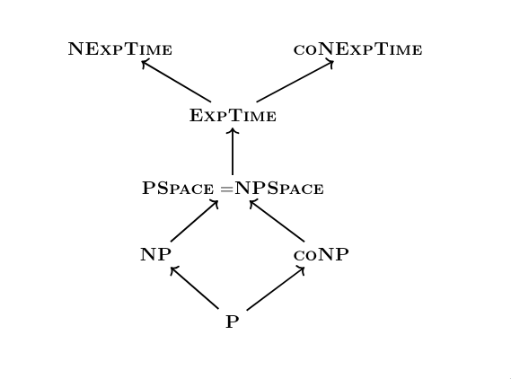

# Complejidad Computacional — Clase 7

## Espacio usado por un computo

### Espacio de una maquina deterministica

**Definicion:** Dada una maquina deterministica $M$ y $x \in \{0,1\}^*$, el **espacio** que usa $M$ con entrada $x$ es la cantidad de celdas por las que alguna vez paso la cabeza en las cintas de trabajo y de salida a lo largo del computo de $M$ a partir de $x$.

### Espacio en una maquina no-deterministica

**Definicion:** Identica a la anterior, con la diferencia de que una maquina no-deterministica tiene multiples computos. El espacio usado es el maximo sobre todos ellos.

### Espacio usado en una maquina

**Definicion:** Sea $M$ una maquina (deterministica o no-deterministica).

- **Usa espacio** $S(n)$ si para toda entrada $x$, el espacio que usa $M$ con entrada $x$ es a lo sumo $S(|x|)$.
- **Usa espacio** $O(S(n))$ si existe una constante $c$ tal que para todo $x$, salvo finitos, $M$ con entrada $x$ usa espacio $c \cdot S(|x|)$.

### SPACE($S(n)$) y NSPACE($S(n)$)

- **SPACE($S(n)$):** clase de lenguajes $\mathbb{L}$ tal que existe una maquina deterministica $M$ que decide $\mathbb{L}$ usando espacio $O(S(n))$.
- **NSPACE($S(n)$):** clase de lenguajes $\mathbb{L}$ tal que existe una maquina no-deterministica $N$ que decide $\mathbb{L}$ usando espacio $O(S(n))$.

### Funciones construibles en espacio

**Definicion:** Una funcion $S : \mathbb{N} \to \mathbb{N}$ es **construible en espacio** si la funcion $1^n \mapsto S(n)$ es computable en espacio $O(S(n))$.

En criollo: existe una maquina deterministica que, a partir de $n$ unos, computa $S(n)$ usando a lo sumo $O(S(n))$ celdas.

**Ejemplos:** $\log n,\ n,\ n^2,\ 2^n$.

> A diferencia del tiempo, aqui si nos interesan funciones $S(n) < n$, ya que no medimos el espacio de la cinta de entrada. Sin embargo, muchas veces vamos a requerir $S(n) \geq \log n$ para poder recordar cualquier indice de la cinta de entrada (representable con $\leq \log n$ bits).

### DTIME($S(n)$) $\subseteq$ SPACE($S(n)$) $\subseteq$ NSPACE($S(n)$)

**Proposicion:** $\textbf{DTIME}(S(n)) \subseteq \textbf{SPACE}(S(n))$

**Demostracion:** En cada paso, una maquina deterministica puede usar a lo sumo una celda mas por cinta. Si $M$ corre en tiempo $O(S(n))$, fisicamente no puede usar mas de $O(S(n))$ espacio.

**Proposicion:** $\textbf{SPACE}(S(n)) \subseteq \textbf{NSPACE}(S(n))$

**Demostracion:** Toda maquina deterministica puede simularse por una no-deterministica que decide el mismo lenguaje con el mismo uso de espacio.

### Grafo de configuraciones

**Definicion:** Sea $M$ una maquina que usa espacio $S(n)$. El **grafo de configuraciones** de $M$ con entrada $x$, notado $G_{M,x}$, es un grafo dirigido donde:

- Los **vertices** son todas las configuraciones posibles usando hasta $S(|x|)$ celdas en cada cinta de trabajo y salida.
- Hay una **arista** de $C$ a $C'$ si $C'$ es una evolucion en un paso de $C$ segun $M$.

**Observacion:** $M$ acepta $x$ si y solo si existe un camino en $G_{M,x}$ desde la configuracion inicial hasta alguna configuracion final.

Propiedades segun el tipo de maquina:

- Si $M$ es **deterministica**: $G_{M,x}$ tiene out-degree 1. Hay un unico estado final $C_{si}$.
- Si $N$ es **no-deterministica**: $G_{N,x}$ tiene out-degree $\leq 2$. Hay un unico estado final $C_{si}$.

### Codificacion de configuraciones

**Proposicion:** Sea $M$ una maquina que usa espacio $S(n)$ con $S(n) \geq \log n$. Existe una constante $c$ (dependiente de $M$) tal que para todo $x$, cada vertice de $G_{M,x}$ se puede describir con $c \cdot S(|x|)$ bits. Por lo tanto, $G_{M,x}$ tiene a lo sumo $2^{c \cdot S(|x|)}$ nodos.

**Idea de la demostracion:** Una configuracion $C$ de $M = (\Sigma, Q, \delta)$ con $k$ cintas de trabajo se codifica como:

$$\langle C \rangle = \langle \langle q \rangle, \langle E \rangle, \langle T_1 \rangle, \dots, \langle T_k \rangle, \langle Z \rangle \rangle$$

donde:
- $\langle q \rangle$: estado actual (bits constantes).
- $\langle E \rangle = \langle p \rangle$: posicion de la cabeza en la cinta de entrada (en binario, $\leq \log n$ bits).
- $\langle T_i \rangle$: contenido y posicion de la cabeza en la $i$-esima cinta de trabajo ($O(S(n))$ bits).
- $\langle Z \rangle$: idem para la cinta de salida.

En total: $|C| = d \cdot ((k+1) \cdot S(n) + \log n) = c \cdot S(n)$.

### NSPACE($S(n)$) $\subseteq$ DTIME($2^{O(S(n))}$)

**Proposicion:** Si $S$ es construible en espacio, entonces $\textbf{NSPACE}(S(n)) \subseteq \textbf{DTIME}(2^{O(S(n))})$.

**Demostracion:** Sea $N$ una maquina no-deterministica que decide $L$ en espacio $O(S(n))$. Definimos una maquina deterministica $M$ que con entrada $x$:

1. Construye $G_{N,x}$ (toma tiempo $2^{O(S(n))}$).
2. Usa BFS para decidir si existe un camino desde la configuracion inicial hasta la configuracion final $C_{si}$.

Como el out-degree de $G_{N,x}$ es $\leq 2$, la cantidad de aristas es $O(2^{O(S(|x|))})$. BFS corre en tiempo $O(|V| + |E|)$, por lo que $M$ corre en tiempo $O(2^{O(S(n))})$.

---

## Espacio polinomial: PSPACE y NPSPACE

### Definicion

- **PSPACE** $= \bigcup_{c > 0} \text{SPACE}(n^c)$
- **NPSPACE** $= \bigcup_{c > 0} \text{NSPACE}(n^c)$

**Observacion:** $\textbf{PSPACE} \subseteq \textbf{NPSPACE} \subseteq \textbf{ExpTime}$.

### NP $\subseteq$ PSPACE

**Proposicion:** $\textbf{NP} \subseteq \textbf{PSPACE}$.

**Demostracion:** Sea $L \in \textbf{NP}$. Existe $M$ deterministica y polinomio $p$ tal que:

$$x \in L \iff \exists\, u \in \{0,1\}^{p(|x|)} \text{ tal que } M(\langle x, u \rangle) = 1$$

Definimos $M'$ que con entrada $x$ simula $M(\langle x, u \rangle)$ para cada $u \in \{0,1\}^{p(|x|)}$, reutilizando siempre las mismas $p(|x|)$ celdas para escribir $u$. Si alguna simulacion acepta, $M'$ escribe 1; si no, escribe 0.

$M'$ corre en tiempo exponencial, pero solo usa espacio $p(|x|)$ mas el espacio que usa $M$ con entrada $\langle x, u \rangle$. Por lo tanto $L \in \textbf{PSPACE}$.

### La jerarquia de espacios

**Teorema:** Si $f, g$ son construibles en espacio y $f(n) = o(g(n))$, entonces:

$$\textbf{SPACE}(f(n)) \subsetneq \textbf{SPACE}(g(n))$$

**Demostracion (esquema):** Se construye una maquina diagonalizadora $D$ que usa espacio $g(n)$ y hace lo opuesto a cualquier maquina que opere en espacio $f(n)$:

1. $D$ calcula $g(|w|)$ y marca esa cantidad de celdas.
2. $D$ simula $M$ sobre $w$:
   - Si la simulacion excede $g(|w|)$ celdas, $D$ **rechaza**.
   - Si $M$ **acepta** $w$, entonces $D$ **rechaza**.
   - Si $M$ **rechaza** $w$, entonces $D$ **acepta**.

Por construccion $D \in \textbf{SPACE}(g(n))$. Si el lenguaje de $D$ estuviera en $\textbf{SPACE}(f(n))$, existiria $M_L$ que lo decide en espacio $c \cdot f(n)$. Como $f(n) = o(g(n))$, para $n$ suficientemente grande $c \cdot f(n) < g(n)$, con lo cual la simulacion termina y $D(M_L)$ haria lo opuesto a $M_L$: contradiccion.

---

## Formulas booleanas cuantificadas (QBF)

### Definicion

Una **formula booleana cuantificada (QBF)** es una expresion de la forma:

$$Q_1 x_1\ Q_2 x_2\ \dots\ Q_n x_n\ \varphi(x_1, x_2, \dots, x_n)$$

donde:
- $Q_i$ es $\forall$ o $\exists$.
- $\varphi$ es una formula booleana con variables entre $x_1, \dots, x_n$ (y posiblemente constantes 0, 1).
- Las variables $x_i$ son **booleanas**: solo pueden tomar valor 0 (falso) o 1 (verdadero).

Las QBF estan en **forma prenexa**: todos los cuantificadores aparecen al frente.

Como todas las variables estan cuantificadas (son **sentencias**), una QBF es verdadera o falsa independientemente de cualquier asignacion.

**Ejemplo de QBF falsa:**

$$\psi = \forall x_1 \exists x_2 \forall x_3\ (x_1 \vee \neg x_2) \wedge (\neg x_1 \vee x_3)$$

Es falsa: si $x_1 = 1$, entonces $x_3$ debe ser 1, pero $x_3$ esta cuantificada universalmente.

### Eliminacion de cuantificadores

Dada $\psi = Q_1 x_1\ \rho(x_1, \dots, x_n)$, definimos $\psi \upharpoonright_{x_1 = b}$ como el resultado de reemplazar todas las ocurrencias de $x_1$ en $\rho$ por la constante $b \in \{0, 1\}$.

- Si $Q_1 = \forall$: $\models \psi \iff \models \psi \upharpoonright_{x_1=0}$ y $\models \psi \upharpoonright_{x_1=1}$.
- Si $Q_1 = \exists$: $\models \psi \iff \models \psi \upharpoonright_{x_1=0}$ o $\models \psi \upharpoonright_{x_1=1}$.

### El problema TQBF

$$\textbf{TQBF} = \{ \langle \psi \rangle : \psi \text{ es una QBF tal que } \models \psi \}$$

### TQBF $\in$ PSPACE

**Teorema:** $\textbf{TQBF} \in \textbf{PSPACE}$.

**Demostracion:** Definimos una funcion recursiva $F$ con:
- **Entrada:** una QBF $\psi = Q_1 x_1 \dots Q_n x_n\ \varphi$.
- **Salida:** 1 si $\models \psi$, 0 en caso contrario.

```
F(psi):
  si n = 0:
    evaluar phi (solo constantes) en tiempo O(|psi|)
  si no (psi = Q x rho):
    i = F(psi con x=0)
    j = F(psi con x=1)   # se reutiliza el espacio
    si Q = ForAll: devolver 1 si i = j = 1; si no, 0
    si Q = Exists: devolver 1 si i = 1 o j = 1; si no, 0
```

Cada llamado recursivo reutiliza el mismo espacio. En cada nivel decrementamos el numero de variables. Como cada llamado necesita espacio $O(|\psi|)$ para escribir la formula con la variable reemplazada, y hay a lo sumo $n \leq |\psi|$ niveles de recursion, el espacio total es $O(|\psi|^2)$. Luego $\textbf{TQBF} \in \textbf{PSPACE}$.

### QBFs con variables libres y QBFs generalizadas

Podemos extender las QBFs con **variables libres** $y_1, \dots, y_m$:

$$\psi(y_1, \dots, y_m) = Q_1 x_1 \dots Q_n x_n\ \varphi(x_1, \dots, x_n, y_1, \dots, y_m)$$

donde $x_1, \dots, x_n$ son variables **ligadas** e $y_1, \dots, y_m$ son variables **libres**. La verdad depende de una valuacion $v : \{y_1, \dots, y_m\} \to \{0,1\}$, y notamos $v \models \psi$ cuando $\psi$ es verdadera para $v$.

Tambien podemos considerar una gramatica mas general (**QBFs generalizadas**), que permite cuantificadores en cualquier posicion (no solo en forma prenexa):

$$\varphi ::= x \mid 0 \mid 1 \mid \neg\varphi \mid \varphi \wedge \varphi \mid \varphi \vee \varphi \mid \forall x\,\varphi \mid \exists x\,\varphi$$

**Proposicion:** En tiempo polinomial se puede transformar cualquier QBF generalizada $\psi(y_1, \dots, y_m)$ en una QBF equivalente $\psi'(y_1, \dots, y_m)$ en forma prenexa, usando las reglas:

$$\neg \forall x\,\psi = \exists x\,\neg\psi \qquad \neg\exists x\,\psi = \forall x\,\neg\psi \qquad \psi * (Qx\,\varphi(x)) = Qx\,(\varphi * \psi)$$

(con $Q \in \{\forall, \exists\}$, $* \in \{\wedge, \vee\}$, y $\psi$ sin ocurrencias libres de $x$).

### El problema CHECKQBF

$$\textbf{CHECKQBF} = \{ \langle \psi, v \rangle : \psi \text{ es una QBF generalizada con } m \text{ variables libres},\ v \in \{0,1\}^m,\ v \models \psi \}$$

**Proposicion:** $\textbf{CHECKQBF} \leq_p \textbf{TQBF}$.

**Demostracion:** Dada $(\psi, v)$, llevamos $\psi$ a forma prenexa $\psi'$ en tiempo polinomial. Luego construimos $\psi''$ reemplazando cada variable libre $y_j$ por la constante $v(j)$. Entonces:

$$v \models \psi(y_1, \dots, y_m) \iff \models \psi''$$

La transformacion $(\psi, v) \mapsto \langle \psi'' \rangle$ es computable en tiempo polinomial.

### TQBF es PSPACE-completo

**Teorema:** $\textbf{TQBF} \in \textbf{PSPACE-hard}$.

**Demostracion:** Sea $L \in \textbf{PSPACE}$ y $M$ una maquina deterministica que decide $L$ en espacio $S(n)$ (polinomial). Vamos a ver que $L \leq_p \textbf{TQBF}$.

Trabajamos con el grafo $G_{M,x}$, donde cada configuracion $C$ se representa con $c \cdot S(n)$ bits. Sean $C_0$ la configuracion inicial y $C_f$ la final.

Definimos formulas $\psi_i(\bar{s}, \bar{t})$ con variables libres $\bar{s}, \bar{t}$ (tuplas de $c \cdot S(n)$ bits) tal que:

$$\langle C \rangle \langle C' \rangle \models \psi_i(\bar{s}, \bar{t}) \iff \text{existe un camino de longitud} \leq 2^i \text{ en } G_{M,x} \text{ entre } C \text{ y } C'$$

Como $G_{M,x}$ tiene $\leq 2^{c \cdot S(n)}$ vertices, si hay algun camino de $C_0$ a $C_f$ entonces hay uno de longitud $\leq 2^{c \cdot S(n)}$. Por lo tanto:

$$x \in L \iff \langle C_0 \rangle \langle C_f \rangle \models \psi_{c \cdot S(n)}(\bar{s}, \bar{t})$$

**Construccion de $\psi_i$ por recursion:**

- **Caso base** $\psi_0(\bar{s}, \bar{t}) = (\bar{s} = \bar{t}) \vee \varphi_{M,x}(\bar{s}, \bar{t})$

  donde $\varphi_{M,x}(\bar{s}, \bar{t})$ es la formula en CNF que verifica si hay una flecha de $C$ a $C'$ en $G_{M,x}$.

- **Caso recursivo (version ingenua):**

$$\psi_i(\bar{s}, \bar{t}) = \exists \bar{r}\, \big[\psi_{i-1}(\bar{s}, \bar{r}) \wedge \psi_{i-1}(\bar{r}, \bar{t})\big]$$

  El problema es que esta definicion dobla el tamano de la formula en cada paso, resultando en $|\psi_i| = O(2^i)$, lo que es exponencial. **No sirve**.

- **Caso recursivo (version corregida con cuantificador universal):**

$$\psi_i(\bar{s}, \bar{t}) = \exists \bar{r}\, \forall \bar{u}, \bar{v}\; \Big[ \big((\bar{u} = \bar{s} \wedge \bar{v} = \bar{r}) \vee (\bar{u} = \bar{r} \wedge \bar{v} = \bar{t})\big) \to \psi_{i-1}(\bar{u}, \bar{v}) \Big]$$

  El truco es usar $\forall \bar{u}, \bar{v}$ para forzar que se verifiquen ambos subproblemas ($C \to C''$ y $C'' \to C'$) usando una sola copia de $\psi_{i-1}$. Asi el tamano crece linealmente: $|\psi_i| = |\psi_{i-1}| + O(S(n))$.

  Como hay $c \cdot S(n)$ niveles de recursion, $\psi_{c \cdot S(n)}$ se puede computar en tiempo polinomial en $S(n)$, que es polinomial en $n$.

Finalmente, $\psi_{c \cdot S(n)}$ es una QBF generalizada que se convierte a forma prenexa en tiempo polinomial. La reduccion es:

$$x \mapsto \langle \psi_{c \cdot S(n)}, \langle C_0 \rangle \langle C_f \rangle \rangle$$

lo que prueba $L \leq_p \textbf{CHECKQBF} \leq_p \textbf{TQBF}$.

**Corolario:** $\textbf{TQBF} \in \textbf{PSPACE-completo}$.

## Teorema de Savitch

**Teorema (Savitch):** **NSPACE**$(S(n))$ $\subseteq$ **SPACE**$(S(n)^2)$

**Corolario:** **PSPACE** $=$ **NPSPACE**

[Demostracion en la pagina 39](../teoricas/clase7.pdf)


### Diagrama de inclusión de clases de complejidad

<p align="center">
  
</p>
