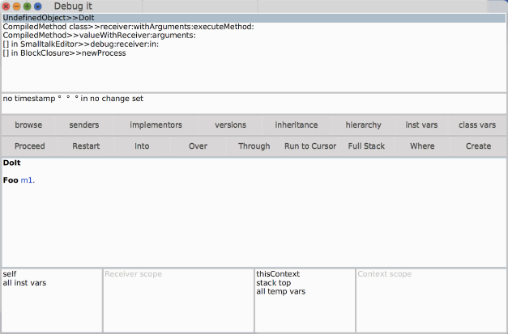
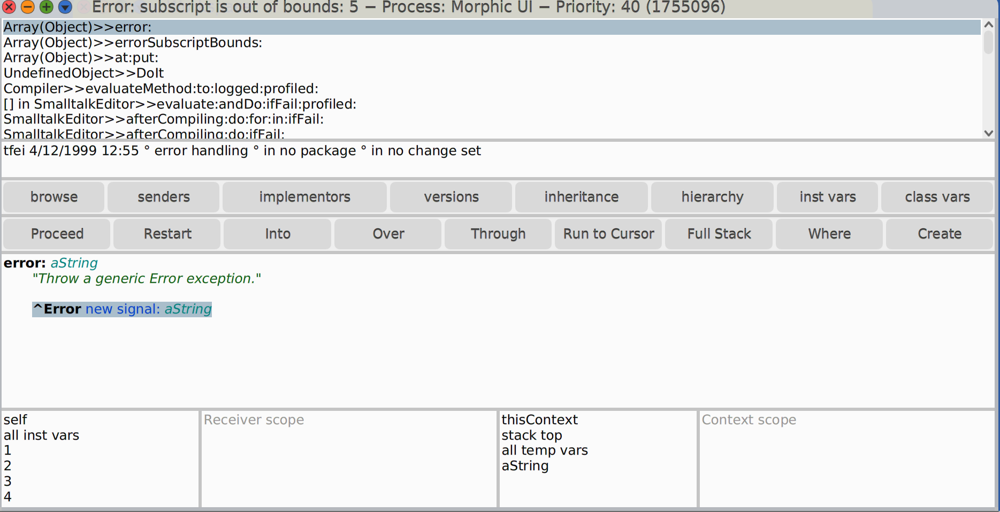

# Guía de Ejercicios - Ingeniería de Software I
## Parte 1: Introducción al paradigma, el lenguaje y sus herramientas
### Sección 2: Introducción al lenguaje Smalltalk

> Los enunciados de los ejercicios se encuentran en el PDF aparte [Enunciados](guia1-seccion2.pdf).

---

## Ejercicio 0: Debugger

### 0.1

 

| Sección | Descripción |
|:-------:|:-----------:|
| **Stack de llamadas** | Muestra la cadena de mensajes enviados hasta llegar al punto de ejecucion actual |
| **Barra de estado** | Indica el estado del método actual y el change set al que pertenece |
| **Barra de navegación** | Permite explorar el código relacionado al método actual, como sus implementaciones, versiones y jerarquia |
| **Barra de acciones** | Controla el flujo de ejecucion del debugger, permite avanzar, reiniciar o entrar en los métodos |
| **Panel de código** | Muestra el código fuente del método que se esta ejecutando actualmente |
| **Panel self** | Muestra el objeto receptor y sus variables de instancia |
| **Receiver scope** | Muestra los valores de las variables del objeto receptor en el contexto actual |
| **thisContext** | Muestra las variables temporales del contexto de ejecucion actual |
| **Context scope** | Muestra las variables del contexto del bloque o método en ejecucion |

### 0.2

[Ver codigo](code/ejercicio0-2.st)

- **Into (Step Into):**
Entra dentro del método que se está ejecutando para ver su detalle paso a paso.

  **Over (Step Over):**
Ejecuta el método completo sin entrar en su implementación.

  **Through (Step Return):**
Ejecuta el resto del método actual y vuelve al contexto anterior.

- Lo que sucede al hacer click en **Restart** es que comienza nuevamente la ejecucion del metodo actual.

- El debugger queda ubicado al inicio del metodo 2 y la variable `aVar` tiene el valor que tenia en el ultimo mensaje de `m2` es decir ese ultimo mensaje se respondio, pero reinicie la ejecucion del mensaje `m2`.

---

## Ejercicio 1: Colecciones

### 1.1

- **a)** Como dice el nombre son colecciones de tamaño fija entonces si intentamos agregar mandaria una excepcion.

   

- **b) Ordered Collections**

  ```Smalltalk
    x := OrderedCollection with: 4 with: 3 with: 2 with: 1.

    x add: 42.
    x add: 2.

    x size.
  ```

   La coleccion cuenta con 6 elementos utilizando el mensaje `size` se puede visualizar  y si printeamos la coleccion podremos ver que el 2 aparece 2 veces. 

- **c) Sets**
  
  ```Smalltalk
  x := Set with: 4 with: 3 with: 2 with: 1.

  x add: 42.
  x add: 2.

  x size.
  ```

  La coleccion tiene 5 elementos ya que como es un conjunto el 2 solo aparece una vez.

- **d) Dictionary**

  ```Smalltalk
  x := Dictionary new.
  x add: #a->4; add: #b->3; add: #c->1; add: #d->2; yourself.

  x add: #e->42.

  x size .

  x keys.
  x values.

  x at: #a.

  x at: #z ifAbsent: [24].
  ```
  La coleccion tiene 5 elementos.

### 1.2

- **e)**  Conversion de array a Set y OrderedCollection.

  ```Smalltalk
  x := #(1 2 3 4).

  x asSet .

  x asOrderedCollection .
  ```

- **f)** Conversion de Set a Array.
  
  ```Smalltalk
  x := Set with: 4 with: 3 with: 2 with: 1.

  x asArray .
  ```
    
- **g)** Lo que retorna al convertir un diccionario en array es la lista con los valores del diccionario.

### 1.3

Codigo que filtra impares con #whileTrue.
  
  ```Smalltalk
|elements index odds|

elements := #(1 2 4 6 9).
odds := OrderedCollection new.
index := 1.

[index <= elements size] whileTrue: [
    ((elements at: index) odd) ifTrue: [odds add: (elements at: index)].
    index := index + 1.
].

odds.
```

### 1.8

Codigo que filtra impares con #do.
```Smalltalk 
|elements odds|

elements := #(1 2 4 6 9).
odds := OrderedCollection new.

elements do: [:element | element odd ifTrue: [odds add: element ]].

odds.
```

La ventaja que nos ofrece #do: contra #whileTrue es que no ahorra tener que verficar un condicion de salida tan trivial como lo es el indice, ademas de que es mucho mas declarativo el codigo con #do:, por otro lado no tenemos que utilizar un contador.

### 1.9

Codigo que filtra impares con #select.

```Smalltalk
|elements odds|

elements := #(1 2 4 6 9).
odds := OrderedCollection new.

odds := elements select: [:element | element odd].

odds. #(1 9) .
```
Ventajas de #select: contra #do: todavia mas declarativo el codigo, no hace falta insertar cada elemento, filtra en base a un preficado.

### 1.10 y 1.11

Primero vamos con el codigo con el mensaje #whileTrue:

```Smalltalk
|elements double index|

elements  := #(1 2 3 4 5).
index := 1.
double := OrderedCollection  new.

[index <= elements size] whileTrue: [
		double add: (elements at: index) * 2.
		index := index + 1.
	].

double .
```

Ahora con el codigo con el mensaje #do:

```Smalltalk
|elements double|

elements  := #(1 2 3 4 5).
double := OrderedCollection  new.

elements do: [:element | double add: element *2].

double .
```

El valor se debe acumular en otro objeto auxiliar de tipo OrderedCollection.

### 1.12

Ahora vamos con mensaje especifico para resolver esto de la manera compacta, la cual es el mensaje #collect:

```Smalltalk
|elements double|

elements  := #(1 2 3 4 5).
double := OrderedCollection  new.

double  := elements collect: [:aElement | aElement  * 2]
```

Este nuevo mensaje lo que retorna es un nuevo objeto de tipo Array la cual contiene el resultado de aplicar el clousure.

### 1.13

Vamos primero con la version #whileTrue de encontrar par:

```Smalltalk
|elements even index|

elements  := #(1 2 3 4 5).
index := 1.

even := [index  <= elements size] whileTrue: [ 
	(elements at: index ) even ifTrue: [
			^ elements at: index .
		].
		index := index + 1.
	].
```

Vamos con la version con el mensaje #do:

```Smalltalk
|elements even| 

elements := #(1 2 3 4 5).

even := elements do: [:element | element even ifTrue: [^ element ]].
```
Vamos
Ahora vamos con el mensaje especifico el cual es #findFist: se le debe pasar como colaborardor un clousure con el predicado que debe cumplir el elemento de la coleccion:

```Smalltalk
|elements even| 

elements := #(1 2 3 4 5).

even := elements findFirst: [:element | element even]. 2 .
```

### 1.14

Lo que ocurre si utilizamos una secuencia sin pares es que nos retorna 0 por defecto.

### 1.15

Codigo modificado para generar un error si no hay pares.

```Smalltalk
|elements | 

elements := #(1 3 2  5).

firstIndex := elements findFirst: [:element | element even].
firstIndex := 0 ifTrue: [self  error: 'No hay pares'].
```

### 1.16 y 1.17

Asumimos que #whileTrue y #do ya sabemos hacerlos. Vamos con el mensaje especifico y con **#inject:into:**.

>**Nota:** el inject: es el caso base y into: toma el acumulador y el elemento i-esimo.

```Smalltalk
|elements sum|

elements := #(1 2 3 4 5).

sum := elements inject: 0 into: [:aPartialSum :aNumber | aPartialSum  + aNumber ]. 
```

Y el mensaje especifico para la suma es #sum.

```Smalltalk
|elements sum|

elements := #(1 2 3 4 5).

sum := elements sum.
```


### 1.18

Codigo para filtrar vocales conservando orden relativo:

```Smalltalk
|aString |

aString := 'hola mi nombre es martin'.

aString select: [:aChar | aChar isVowel ].
```

>**Nota:** El select es basicamente un filter de programacion funcional.

### 1.19

Se observa que comparten una interfaz de mensajes.

### 1.20

Algunas conocia de **PLP**.


---

## Ejercicio 2: Bloques (Closures)

### a)

La definicion de **Blocks** en el libro **Smalltalk-80 The Language and its Implementation** es 

### b)

### c)

---

## Ejercicio 3: Símbolos

### a)

### b)

### c)

---

## Ejercicio 4: Medidas

### 4.1

### 4.2

### 4.3

### 4.4

### 4.5

### 4.6

### 4.7

### 4.8

### 4.9

### 4.10

### 4.11

---

## Ejercicio 5: Fechas

### 5.1

### 5.2

### 5.3

### 5.4

### 5.5

### 5.6
