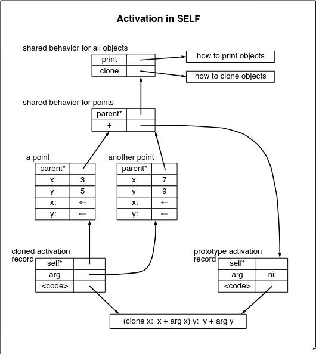

# The Power Of Simplicity

## Abstract del paper

**SELF** es un lenguaje orientado a objetos diseñado para la programación exploratoria. Destaca por su enfoque minimalista, basado en ideas simples y concretas: prototipos, ranuras (*slots*) y comportamiento. Al utilizar prototipos, fusiona la herencia y la instanciación en un marco más flexible. Las ranuras unifican variables y procedimientos en una sola estructura, permitiendo que la herencia maneje el ámbito léxico. Finalmente, al no hacer distinción entre estado y comportamiento, **SELF** reduce drásticamente las diferencias estructurales entre objetos, procedimientos y cierres léxicos (*closures*), ofreciendo un modelo computacional mucho más directo y expresivo.

## Introducción

En este *paper* se define **SELF**, un lenguaje basado en prototipos diseñado para soportar la programación exploratoria. Por su naturaleza, incluye tipado en tiempo de ejecución y recuperación automática de memoria (recolección de basura).

A diferencia de **Smalltalk**, **SELF** no incluye clases ni variables; en su lugar, adopta una metáfora de prototipos para la creación de objetos. Los objetos en **SELF** acceden a su información de estado única y exclusivamente mediante mensajes enviados a `self`.

## Conceptos Clave

A continuación se detallan los principios que han guiado el diseño de **SELF**:

- **Mensajes en el nivel más bajo (*Messages-at-the-bottom*):** **SELF** presenta el paso de mensajes como la operación fundamental. Al no existir variables, simplemente hay ranuras (*slots*) que contienen objetos que se devuelven a sí mismos.
- **La navaja de Ockham (*Occam’s razor*):** Fiel a la economía conceptual, **SELF** omite las variables, por lo que no hay distinción entre acceder a una variable y enviar un mensaje. El núcleo (*kernel*) del lenguaje carece de estructuras de control; todo el flujo se modela de manera elegante utilizando **polimorfismo** y **clausuras** (*closures*).
- **Concreción:** **SELF** intenta ser lo más concreto y tangible posible. En este lenguaje, un objeto nuevo se crea clonando un prototipo existente, y absolutamente cualquier objeto del sistema puede ser clonado.

## Prototipos vs. Clases

Siguiendo con la filosofía de simplicidad, **SELF** carece de un puntero a clase (*class pointer*), algo habitual en otros lenguajes orientados a objetos como C++, Ada, etc. 

En su lugar, **SELF** utiliza ranuras con nombre (*named slots*) que pueden almacenar tanto estado como comportamiento. Si un objeto recibe un mensaje y no encuentra una ranura coincidente, la búsqueda continúa a través de un puntero al padre (*parent pointer*). Es de esta manera que **SELF** implementa la **herencia**.

La eliminación de las clases permite tener relaciones mucho más simples: gracias al enfoque basado en prototipos, existe una única relación estructural entre los objetos, que es la relación **"hereda de"** (*inherits from*). 

Además, este enfoque de prototipos presenta cuatro ventajas fundamentales frente a los lenguajes basados en clases:

1. **Creación por copia:** Crear objetos clonando es una metáfora mucho más simple y directa que la instanciación (que funciona como construir una casa interpretando un plano).
2. **Módulos preexistentes más concretos:** Los prototipos son ejemplos vivos y reales que el programador puede examinar directamente, en lugar de descripciones abstractas, lo que facilita su comprensión y reutilización.
3. **Soporte natural para objetos únicos (*one-of-a-kind*):** Al poder tener ranuras con su propio comportamiento, se pueden crear objetos únicos sin la incomodidad de tener que definir una clase entera para una sola instancia.
4. **Fin de la meta-regresión:** En los sistemas basados en clases, un objeto necesita una clase para existir, que a su vez necesita una metaclase, y así *ad infinitum*. Los prototipos rompen este ciclo infinito al ser objetos completamente autosuficientes.

**El problema del prototipo especial:** Si el comportamiento compartido se guarda en el mismo prototipo, el sistema necesitaría dos formas de crear objetos: una para crear descendientes del prototipo y otra para copiar objetos que no lo son. La solución de **SELF** es extraer el comportamiento compartido y colocarlo en un objeto padre separado. De esta manera, el prototipo queda exactamente idéntico a cualquier otro objeto de la familia y se mantiene la uniformidad.

## Unificando Estado y Comportamiento

Para sostener la idea de que no existen variables tradicionales, en **SELF** todo acceso a la información se realiza enviando mensajes a las ranuras. 

Por ejemplo, para leer una coordenada, el objeto se envía a sí mismo el mensaje `x`. Para modificarla, se envía el mensaje `x:` seguido del nuevo valor. Esto trae beneficios operativos enormes:
- **Transparencia:** Leer un valor estático o calcularlo dinámicamente se ve exactamente igual desde la sintaxis del código que lo llama.
- **Flexibilidad extrema:** Permite reemplazar un dato estático por código ejecutable en tiempo real (por ejemplo, cambiar la ranura `x` para que devuelva un número aleatorio) sin romper la compatibilidad con otros objetos.
- **Variables Activas y Demonios:** Permite interceptar fácilmente la escritura de un dato (reemplazando el mensaje de asignación `x:` por una función de interrupción), algo muy complejo de lograr de manera limpia en lenguajes convencionales.

## Clausuras y Métodos

En **SELF**, las clausuras (*closures*) se representan mediante un objeto que contiene un enlace de entorno (*environment link*) y un método llamado `value`, `value:`, `value:With:`, y así sucesivamente, dependiendo de la cantidad de argumentos.

- **Variables locales:** En **SELF**, las ranuras (*slots*) cumplen esta función. Por lo tanto, las variables locales se asignan reservando ranuras para ellas en el registro de activación prototipo. Estas ranuras se pueden inicializar con cualquier valor, incluso con otras clausuras o métodos privados.
- **Enlace de entorno (*Environment link*):** Los métodos deben contener un enlace a su clausura o ámbito envolvente. Este enlace se utiliza para resolver las referencias a variables que no se encuentran definidas en el método en sí.
- **Ámbito léxico y el `self` implícito:** Para acceder a las variables locales como a cualquier otro dato, la búsqueda de mensajes en **SELF** inicia en el registro de activación actual, pero el receptor del mensaje se mantiene como el receptor original. Funciona, en cierta forma, de manera opuesta al `super` de Smalltalk.

  

