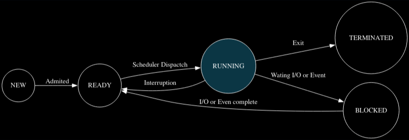
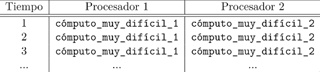
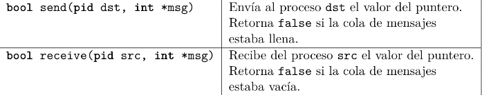

# Procesos y API del SO

## Parte 1: Estado y Operaciones sobre procesos

### Ejercicio 1

Para un cambio de contexto los pasos son los siguientes:

1. Primero se deben guardar todos los registros, flags, etc. en la **PCB** del proceso actual.
2. Luego agregar el puntero de esta **PCB** a la cola del `scheduler` correspondiente.
3. Elegir un nuevo proceso, tomando su **PCB** de la cola de ready del `scheduler`.
4. Cargar el contexto del nuevo proceso a partir de su **PCB**.
5. Por último, comenzar con la ejecución del nuevo proceso.

### Ejercicio 2

#### a) Implementación de la rutina Ke_context_switch
```MyLenguage
struct PCB {
  int STAT;
  int P_ID;
  int PC;
  int R0;
  ...
  int R15;
  int CPU_TIME;
}

void Ke_context_switch(PCB* pcb_0, PCB* pcb_1) {
    pcb_0->PC = PC;
    pcb_0->R0 = R0;
    ...
    pcb_0->R15 = R15;
    pcb_0->STAT = KE_READY;
    pcb_0->CPU_TIME = ke_current_user_time();

    // Reiniciamos el tiempo de la CPU
    ke_reset_current_user_time();

    R0 = pcb_1->R0;
    ...
    R15 = pcb_1->R15;
    PC = ret();

    set_current_process(pcb_1->P_ID);
}
```

### Ejercicio 3

La principal diferencia entre una **syscall** y una llamada a **función de biblioteca** es:

| Característica | Syscall | LibraryCall |
| :--- | :--- | :--- |
| Privilegio | Hay un cambio en el nivel, pasamos a modo kernel | Permanecemos con el mismo nivel de privilegio (Usuario) |
| Contexto | Se debe hacer un guardado de un contexto mínimo | No requiere guardado de contexto |
| Implementación | Se hacen mediante una interrupción, que se vectoriza a una entrada de la **IDT** | Normalmente es código en C |
| Dependencia del **SO** | Completamente dependiente ya que es la **API** del **SO** | No necesariamente (puede ser portable) |
| Costo | Alto (cambio de modo y salto a **Kernel**) | Bajo (simple llamada a función) |
| Relación entre ellas | Muchas veces una library call utiliza syscalls para su implementación | Puede no utilizar syscalls para su implementación |

### Ejercicio 4

El diagrama de estados queda de la siguiente manera:



### Ejercicio 5

a) [Ver código](code/ej5a.c)
```c
int main(void) {
  pid_t pid = fork();
  if (pid == 0) {
    // Homero
    printf("Soy Homero\n");
    sleep(2);
    pid_t bart = fork();
    if (bart == 0) {
      printf("Soy Bart\n");
      exit(0);
    }
    pid_t lisa = fork();
    if (lisa == 0) {
      printf("Soy Lisa\n");
      exit(0);
    }
    pid_t maggie = fork();
    if (maggie == 0) {
      printf("Soy Maggie\n");
      exit(0);
    }
  } else if (pid > 0) {
    printf("Soy Abraham\n");
    exit(0);
  }
  printf("Fallo al ejecutar proceso\n");
  exit(1);
}
```

b) [Ver código](code/ej5b.c)
```c
// Función principal Abraham
int main(void) {
  pid_t pid = fork();

  if (pid == 0) {
    printf("Soy Homero\n");
    sleep(2);
    // Bart
    pid_t pid_b = fork();
    if (pid_b == 0) {
      printf("Soy Bart\n");
      exit(0);
    }
    // Lisa
    pid_t pid_l = fork();
    if (pid_l == 0) {
      printf("Soy Lisa\n");
      exit(0);
    }
    // Maggie
    pid_t pid_m = fork();
    if (pid_m == 0) {
      printf("Soy Maggie\n");
      exit(0);
    }

    wait_for_child(pid_b);
    wait_for_child(pid_l);
    wait_for_child(pid_m);
    exit(0);
  } else {
    printf("Soy Abraham\n");
    wait_for_child(pid);
    exit(0);
  }
}
```

### Ejercicio 6

[Ver código](code/ej6.c)
```c
int system(const char* command) {
    pid_t pid = fork();
    if (pid == 0) {
      exec(command);
      exit(0);
    }

    if (pid < 0) {
      return -1;
    }
    wait_for_child(pid);
    return 0;
}
```

### Ejercicio 7

[Ver código](code/ej7.c)

### Ejercicio 8

Si los datos del proceso padre e hijo son distintos, cuando se ejecuta el proceso hijo el contador `dato` se incrementa en 1 por cada iteración, en cambio en el padre el contador no se incrementa, por lo tanto siempre es 0. Como son procesos distintos tienen memoria separada, por lo tanto el **dato** es distinto en cada uno. Esto se debe al **copy-on-write**: el proceso hijo recibe una copia de la memoria del padre independiente.

### Ejercicio 9

[Ver código](code/ej9.c)

### Ejercicio 10

[Ver código](code/ej10.c)

El comando para ver el **strace** es `strace -f -o <binario>`

---

## Parte 2: IPC y Pasaje de Mensajes

### Ejercicio 11

Tenemos las siguientes llamadas:

| Función | Firma | Descripción |
| :--- | :--- | :--- |
| **Envío** | `void bsend(pid dst, int msg)` | Envía el valor **msg** al proceso **dst**. |
| **Recepción** | `int breceive(pid src)` | Recibe un mensaje del proceso **src**. |

a) Tenemos que escribir un código el cual realice la secuencia descripta un número n de veces.
```c
#include <stdio.h>
#include <unistd.h>

int main(void) {
    pid_t father = get_current_pid();
    pid_t child = fork();
    int limite = 100;

    if (child < 0) {
        exit(1);
    }

    if (child == 0) {
        // Lógica del hijo
        int valor_recibido;
        int proximo_envio = 1;
        while (1) {
            valor_recibido = breceive(father);
            if (valor_recibido >= limite) break;
            printf("El hijo recibió: %d\n", valor_recibido);
            bsend(father, proximo_envio);
            proximo_envio += 2;
        }
    } else {
        // Lógica del padre
        int valor_recibido;
        int proximo_envio = 0;
        while (1) {
            bsend(child, proximo_envio);
            proximo_envio += 2;
            valor_recibido = breceive(child);
            if (valor_recibido >= limite) break;
            printf("El padre recibió: %d\n", valor_recibido);
        }
    }

    return 0;
}
```

b) Ahora con la otra secuencia descripta:
```c
#include <stdio.h>
#include <unistd.h>

int main(void) {
  int limit = 50;
  pid_t father = get_current_pid();

  pid_t child1 = fork();
  if (child1 < 0) exit(1);

  if (child1 == 0) {
    pid_t child2 = (pid_t) breceive(father);

    int value;
    while (1) {
      value = breceive(father);
      if (value > limit) break;
      printf("Hijo1 recibió de Padre: %d\n", value);
      bsend(child2, value + 1);
    }

  } else {
    pid_t child2 = fork();
    if (child2 < 0) exit(1);

    if (child2 == 0) {
      int value;
      while (1) {
        value = breceive(child1);
        if (value > limit) break;
        printf("Hijo2 recibió de Hijo1: %d\n", value);
        bsend(father, value + 1);
      }

    } else {
      bsend(child1, (int) child2);
      bsend(child1, 0);

      int value;
      while (1) {
        value = breceive(child2);
        if (value > limit) break;
        printf("Padre recibió de Hijo2: %d\n", value);
        bsend(child1, value + 1);
      }
    }
  }

  return 0;
}
```

### Ejercicio 12

a) Esta es la secuencia descripta en el ejercicio:



Teniendo en cuenta que **bsend** y **breceive** son las mismas que el ejercicio anterior, en el mismo se menciona que ambas son bloqueantes y que la cola de mensajes es de capacidad 0, lo que significa que no se tiene un buffer temporal para guardar mensajes.
Por lo tanto, esto imposibilita el procesamiento paralelo continuo en cada paso de ejecución, ya que cuando el proceso izquierdo hace un **bsend**, para poder continuar debe haber un **breceive** del otro lado.

Una secuencia posible de ejecución sería la siguiente:

| Tiempo | Proceso Izquierdo        | Proceso Derecho          |
|--------|--------------------------|--------------------------|
| 1      | bsend (bloqueado)        | cómputo_muy_difícil_2    |
| 2      | bsend ↔ breceive         | breceive                 |
| 3      | cómputo_muy_difícil_1    | printf / siguiente paso  |
| 4      | bsend (bloqueado)        | cómputo_muy_difícil_2    |
| 5      | bsend ↔ breceive         | breceive                 |
| 6      | cómputo_muy_difícil_1    | printf / siguiente paso  |
| ...    | ...                      | ...                      |

b) Los cambios que se podrían hacer al sistema operativo serían los siguientes:

1. Se podría implementar un buffer temporal para poder escribir los resultados del cómputo y así mantener una cola de mensajes en lugar de una cola de capacidad 0.
2. Utilizar alguna syscall no bloqueante en lugar de **bsend** y **breceive**.

### Ejercicio 13

a) Como ambos procesos **cortarBordes** y **eliminarOjosRojos** se ejecutan de manera concurrente, lo mejor sería mantener el archivo `.jpg` en memoria compartida, incluyendo un mecanismo de sincronización para evitar condiciones de carrera y asegurar la consistencia del archivo.

b) Lo más conveniente sería utilizar pasaje de mensajes, ya que se ejecutan de manera secuencial: una vez finalizado **cortarBordes**, envía un mensaje al proceso **eliminarOjosRojos** para que inicie la ejecución. Adicionalmente sería conveniente mantener la copia en memoria compartida, dado que ambos procesos utilizan el mismo recurso.

c) Como aquí los procesos **cortarBordes** y **eliminarOjosRojos** se ejecutan en máquinas diferentes, la única forma sería mediante pasaje de mensajes, y dependerá del orden en el que se requiera ejecutarlos.

### Ejercicio 14

Tenemos 2 nuevas syscalls:



a) Modificación:
```c
int result;

void proceso_izquierda() {
  result = 0;
  while (true) {
    while (!send(pid_derecha, &result)) {
      sleep(2);
    }
    result = computo_muy_dificil_1();
  }
}

void proceso_derecha() {
  int left_result;
  while (true) {
    int result = computo_muy_dificil_2();
    while (!receive(pid_izquierda, &left_result)) {
      sleep(2);
    }
    printf("%s %s", left_result, result);
  }
}
```

b) La capacidad que debería tener la cola de mensajes debería ser suficiente para evitar la sincronización estricta entre ambos procesos. Un tamaño de al menos 1 permite desacoplar el envío y la recepción, evitando bloqueos y permitiendo un mayor paralelismo. Mientras más grande sea la cola, mejor.

### Ejercicio 15

1. **BLOQUEANTE**: Supongamos que tenemos una aplicación que tiene un archivo de configuración. El **proceso 1** se encarga de leer ese archivo y pasarle los datos al **proceso 2**, el cual se encarga de seguir esa configuración. En este caso hay una dependencia de datos y se requiere que la comunicación sea bloqueante.

2. **NO BLOQUEANTE**: Supongamos que tenemos un programa de explorador de archivos con interfaz gráfica (GUI). La interfaz tiene que atender eventos del usuario y no puede ser bloqueante, ya que debe seguir actualizando la interfaz.

### Ejercicio 16

[Ver código](code/ej16.c)

### Ejercicio 17

[Ver código](code/ej17.c)

### Ejercicio 18

Aqui vamos a hacer el codigo en formato `Markdown` debido a que hay funciones que son de caja negra:

```C
enum {READ,WRITE};

//Variable para saber si el nieto termino, se cambia mediante una senial
volatile int nieto_termino = 0;

void  handler(int sig) {
  nieto_termino = 1;
}

void ejecutarHijo(int i, int pipes[][2]) {
  int current_pipe[2] = pipes[i]; 
  int res;
  
  int numero;
  read(current_pipe[READ],&numero,sizeof(numero));

  //Instalar la senial antes del fork
  signal(SIGUSR1,handler);

  pid_t pid = fork();
  if (pid == 0) {
    res = calcular(numero);

    //Enviamos el resultado al padre del nieto
    write(current_pipe[WRITE],&res,sizeof(res));
    kill(getppid(),SIGUSR1);
    exit(0);
  } else {
    while(!nieto_termino) {
      pause();
    }

    waitpid(pid,NULL,0);
    
    int res;
    read(current_pipe[READ],&res,sizeof(read));

    //Ahora tenemos que responder al padre/abuelo
    int ready = 1;
    write(current_pipe[WRITE],&ready,sizeof(ready));
    write(current_pipe[WRITE],&i,sizeof(i));
    write(current_pipe[WRITE],&res,sizeof(res));

    exit(0); 
  }
}
```

### Ejercicio 19

a) Las `funciones` de la `libc` que generan cada `syscall` son:

1. `printf` genera la syscall `write`
2. `sigaction` genera la syscalls `rt_sigaction`  
3. `malloc` genera la syscall `mmap`
4. `fork` genera la syscall `clone`
5. `sigprocmask` genera la syscall `rt_sigprocmask`
6. `sleep` genera la syscall `nanosleep`

b) [Ver código](code/ej19b.c)


---

## Parte 3: Sockets

### Ejercicio 20

a) [Ver código](code/ej20a/)

b) [Ver código](code/ej20b/)

### Ejercicio 21

[Ver código](code/ej21/)

### Ejercicio 22

[Ver código](code/ej22/)
