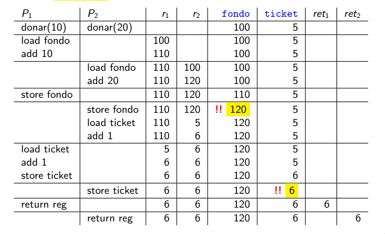
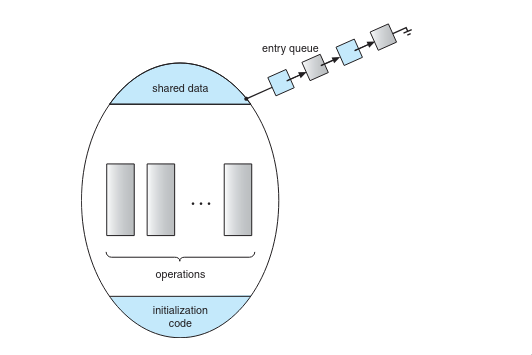

# Sincronización entre Procesos

## ¿Por qué vemos esto?

Las principales motivaciones para estudiar la sincronización entre procesos son:

- La **contención y concurrencia** son 2 problemas fundamentales en un mundo donde cada vez más se tiende a la programación distribuida y/o paralela.
- Además es importantísimo en el mundo de los **SO** ya que tenemos muchas estructuras compartidas y mucha contención.
- Recordemos que una de las características deseadas de un **SO** es que maneje contención y concurrencia de manera correcta y eficiente.

---

## Veamos un ejemplo incorrecto

Contamos con 2 procesos:

- Uno tiene que incrementar el número de ticket y el otro manejar el fondo acumulado.

Contamos con el siguiente código en C y en ASM:

```c
int ticket = 0;
int fondo = 0;
int donar(int donacion) {
  fondo += donacion;
  ticket++;
  return ticket;
}
```

```asm
load fondo
add donacion
store fondo
load ticket
inc ticket
store ticket
return reg
```

### Veamos un posible scheduling

- Dos procesos **P1** y **P2** ejecutan el mismo programa.
- **P1** y **P2** comparten variables `ticket` y `fondo`.



Podemos notar que la ejecución terminó con un resultado inválido. En caso de ejecutarse secuencialmente, los resultados posibles eran 130 para el fondo y cada usuario recibiría los tickets 6 y 7 en algún orden. Aquí lo que sucedió fue una **Condición de Carrera**.

---

## Condición de Carrera

**Definición:** Dos o más procesos o hilos acceden y modifican datos compartidos al mismo tiempo, y el resultado final depende del orden o interleaving en que se ejecutan esas operaciones.

Se dice que hay una condición de carrera cuando:

- Existe **estado compartido** (por ejemplo la variable `ticket`).
- Hay **accesos concurrentes** (sin sincronización adecuada).
- Al menos uno de esos accesos es de escritura.
- El resultado del programa es **no determinista**.

> Las condiciones de carrera no son un problema menor: bugs de este tipo afectaron sistemas reales como MySQL, Apache, Mozilla y OpenOffice, e incluso causaron fallas en sistemas financieros de alto impacto.

### Requerimientos para evitarla

Para resolver correctamente una condición de carrera, toda solución debe cumplir 3 requerimientos:

| Requerimiento | Descripción |
|---------------|-------------|
| **Exclusión mutua** | Si un proceso $P_i$ se está ejecutando en una **sección crítica**, los otros procesos no podrán ejecutar en una **sección crítica**. |
| **Progreso** | Si ningún proceso está ejecutando en su sección crítica y existen procesos que desean entrar, solo aquellos que no están en su sección restante pueden participar en la decisión, y esta no puede postergarse indefinidamente. |
| **Espera acotada** | Existe un límite en la cantidad de veces que otros procesos pueden entrar en sus secciones críticas después de que un proceso haya solicitado entrar y antes de que dicha solicitud sea concedida. |

Estructura general de un programa típico:

```c
while(true) {
    entry section
        critical section
    exit section
        remainder section
}
```

---

## El problema de las secciones críticas

### ¿Qué es una sección crítica?

> **Aclaración:** CRIT refiere a sección crítica.

Una sección crítica es un segmento de código tal que:

- Solo hay un proceso a la vez en **CRIT**.
- Todo proceso que esté esperando a entrar en **CRIT** lo va a hacer.
- Ningún proceso fuera de **CRIT** puede bloquear a otro.

A nivel de código se implementa con dos llamados: uno para entrar y otro para salir de la sección crítica. Entrar a la sección crítica es como poner el cartelito de "no molestar" en la puerta. Si logramos implementar exitosamente secciones críticas, contamos con herramientas para que varios procesos puedan compartir datos sin estorbarse.

### ¿Cómo se implementa una sección crítica?

El problema de secciones críticas se puede resolver de manera sencilla en un entorno de un solo núcleo si se pudieran evitar las interrupciones mientras se modifica una variable compartida. Desafortunadamente, esta solución no es viable en entornos multiprocesador, ya que deshabilitar las interrupciones puede ser costoso en tiempo.

Existen dos enfoques generales para manejar secciones críticas en **sistemas operativos**:

- **Kernel preemptivo (con desalojo):** Permite que un proceso pueda ser interrumpido mientras se está ejecutando en modo kernel.
- **Kernel no preemptivo (cooperativo):** No permite que un proceso en modo kernel sea desalojado; dicho proceso se ejecuta hasta salir de modo kernel, bloquearse o ceder voluntariamente la **CPU**.

> Un kernel no preemptivo está prácticamente libre de condiciones de carrera sobre estructuras de datos del kernel, ya que hay solo un proceso de kernel activo a la vez. En los kernels preemptivos ocurre lo contrario: pueden haber múltiples procesos de kernel en simultáneo.

Otra manera de implementación es mediante **locks**, variables booleanas compartidas:

- Al entrar a la sección crítica se pone en `1`.
- Al salir, se pone en `0`.

Sin embargo, este enfoque no garantiza los 3 requerimientos antes vistos, en particular no garantiza la **exclusión mutua**. Existe un algoritmo correcto con este enfoque llamado **Solución de Peterson**.

---

## Solución de Peterson

La solución de **Peterson** cumple con los 3 requerimientos y hace una correcta implementación de secciones críticas. Se restringe a 2 procesos $P_0$ y $P_1$, que alternan entre sección crítica y sección restante. Para referirse al otro proceso se usa $P_j$, donde $j = 1 - i$.

Se utilizan 2 variables compartidas:

```c
int turn;
bool flag[2];
```

Cada proceso $P_i$ ejecuta:

```c
while(true) {
    flag[i] = true;
    turn = j;
    while(flag[j] && turn == j);
    /* Sección crítica */
    flag[i] = false;
    /* Sección restante */
}
```

| Variable | Descripción |
|----------|-------------|
| `turn` | Indica de quién es el turno para entrar en la sección crítica. |
| `flag` | Indica si el proceso $P_i$ desea entrar. |

> **Problema:** este algoritmo tiene inconvenientes con arquitecturas y compiladores modernos, ya que estos implementan optimizaciones que pueden reorganizar el código, lo que podría provocar que ambos procesos entren en la sección crítica a la vez, generando una condición de carrera.

---

## Soluciones basadas en hardware

> **Aclaración:** voy a llamar **HW** al hardware en algunas ocasiones.

> **Nota:** Recordar de **AyOC** que una instrucción atómica es aquella que no puede ser interrumpida de ninguna manera. Esto vale incluso en sistemas multiprocesador.

Hasta ahora vimos soluciones esencialmente de software, que no usan directamente instrucciones de la arquitectura ni syscalls del SO para garantizar la exclusión mutua.

El **HW** suele proveer una instrucción que permite establecer atómicamente el valor de una variable en `1`. Esta instrucción se suele llamar `TestAndSet`: pone en `1` y devuelve el valor anterior, de manera atómica.

```c
bool test_and_set(bool *target) {
    bool rv = *target;
    *target = true;  // Es lo mismo que 1.
    return rv;       // Valor anterior al cambio.
}
```

Con esto, el algoritmo de exclusión mutua queda:

```c
do {
    while(test_and_set(&lock));
        /* Sección crítica */

    lock = false;

        /* Sección restante */
} while(true);
```

**Problema:** el ciclo interno consume mucho **CPU** ya que está vacío y no hace nada. Una posible solución sería usar la syscall `sleep`, pero ¿cuánto tiempo?

- Si es mucho → perdemos tiempo innecesariamente.
- Si es poco → desperdiciamos **CPU**.

---

## Productor-Consumidor

Ambos comparten un buffer de tamaño limitado más algunos índices para saber dónde se colocó el último elemento, si hay alguno, etc. A este problema a veces se lo conoce como *bounded buffer* (*buffer acotado*).

- Productor pone elementos en el buffer.
- Consumidor los saca.
- De nuevo tenemos un problema de concurrencia, ambos quieren actualizar las mismas variables.
- Pero en este caso hay un problema adicional.
- Si el Productor quiere poner algo cuando el buffer está lleno o el Consumidor quiere sacar algo cuando el buffer está vacío, deben esperar.
- ¿Pero cuánto?
- Podríamos hacer **busy waiting**, pero podemos perder mucho tiempo.
- Podríamos usar `sleep()`-`wakeup()`. ¿Podríamos?

### El lost wakeup problem

Pensemos en el consumidor:

```c
if (cant == 0) sleep();
```

Y el productor:

```c
agregar(item, buffer);
cant++;
wakeup();
```

Miremos un posible interleaving:

| Consumidor | Productor | Variables |
|------------|-----------|-----------|
| | | `cant==0, buffer==[]` |
| | `agregar(i1, buffer)` | `cant==0, buffer==[i1]` |
| `¿ cant==0 ?` | | |
| | `cant++` | `cant==1, buffer==[i1]` |
| | `wakeup()` | |
| `sleep()` | | |

Resultado: el `wakeup()` se pierde y el sistema se traba. A este problema se lo conoce como el *lost wakeup problem*.

---

## Semáforos

Para solucionar estos problemas **Dijkstra** inventó los semáforos.

Un semáforo es una variable entera con las siguientes características:

- Se le puede inicializar en cualquier valor.
- Solo se puede manipular mediante 2 operaciones:
  - `wait()` (también llamada `P()` o `down()`).
  - `signal()` (también llamada `V()` o `up()`).
- Ambas se implementan de tal manera que se ejecutan sin interrupciones.

```c
wait(s):   while (s <= 0) dormir(); s--;
signal(s): s++; if (alguien espera por s) despertar a alguno;
```

Un tipo especial de semáforos que tienen dominio binario son los **mutex**, de *mutual exclusion*.

### Productor-Consumidor con semáforos

```c
semaforo mutex = 1;
semaforo llenos = 0;
semaforo vacios = N; // Capacidad del buffer.

void productor() {
    while(true) {
        item = producir_item();
        wait(vacios);
        // Hay lugar. Ahora necesito acceso exclusivo.
        wait(mutex);
        agregar(item, buffer);
        cant++;
        // Listo, que sigan los demás.
        signal(mutex);
        signal(llenos);
    }
}

void consumidor() {
    while(true) {
        wait(llenos);
        // Hay algo. Ahora necesito acceso exclusivo.
        wait(mutex);
        item = sacar(buffer);
        cant--;
        // Listo, que sigan los demás.
        signal(mutex);
        signal(vacios);
        hacer_algo(item);
    }
}
```

### Implementación de semáforos

La implementación estándar define un struct con un valor y una lista de procesos:

```c
typedef struct {
    int value;
    struct process* list;
} semaphore;
```

Cuando un proceso debe esperar un semáforo, es añadido a la lista. `signal()` remueve un proceso de la lista de espera y lo despierta:

```c
wait(semaphore* S) {
    S->value--;
    if (S->value < 0) {
        add_to_list(S->list, getpid());
        sleep();
    }
}

signal(semaphore* S) {
    S->value++;
    if (S->value <= 0) {
        P = remove_from_list(S->list);
        wakeup(P);
    }
}
```

### Pueden fallar...

El sistema basado en semáforos puede fallar si me olvido un `signal` o invierto el orden. Lo que pasa es que el proceso A se queda esperando a que suceda algo que solo B puede provocar, pero B a su vez está esperando algo de A. A esta situación se la conoce como **deadlock** y es una de las pestes de la concurrencia.

---

## Spin Locks y objetos atómicos

### TASLock

Los lenguajes de alto nivel modernos proveen objetos atómicos para implementar secciones críticas sin depender del SO. Un objeto atómico básico provee operaciones como `getAndSet()` y `testAndSet()`, implementadas de manera indivisible a nivel de hardware:

```c
atomic bool getAndSet(bool b) {
    bool m = reg;
    reg = b;
    return m;
}

atomic bool testAndSet() {
    return getAndSet(true);
}
```

Con esto se puede construir un mutex llamado **TASLock**, también conocido como *spin lock*:

```c
atomic<bool> reg;

void create()  { reg.set(false); }
void lock()    { while(reg.testAndSet()) {} }
void unlock()  { reg.set(false); }
```

> **Cuidado:** `lock()` no es atómico en sí mismo.

Ejemplo de uso:

```c
TASLock mtx;
int donar(int donacion) {
    int res;
    mtx.lock();
    fondo += donacion;
    mtx.unlock();

    mtx.lock();
    res = ticket; ticket++;
    mtx.unlock();

    return res;
}
```

El problema del TASLock es el **busy waiting**: el ciclo interno consume muchísima CPU y perjudica al resto de los procesos.

### TTASLock (local spinning)

Una mejora al TASLock es probar antes de ejecutar el `testAndSet()`, técnica llamada *local spinning*:

```c
void lock() {
    while(true) {
        while(mtx.get()) {}         // Espera leyendo caché (cache hit).
        if(!mtx.testAndSet()) return;
    }
}

void unlock() { mutex.set(false); }
```

Mientras el lock está tomado, el proceso lee desde su caché local en lugar de ejecutar `testAndSet()` repetidamente sobre el bus. Cuando alguien hace `unlock()` hay un *cache miss*, pero el overhead general es significativamente menor.

| Lock | Comportamiento con muchos threads |
|------|----------------------------------|
| **TASLock** | Tiempo crece exponencialmente |
| **TTASLock** | Tiempo crece más suavemente |
| **IdealLock** | Tiempo constante (sin overhead) |

### Otros objetos atómicos

El hardware también provee registros *Read-Modify-Write* atómicos:

```c
atomic int getAndInc() {
    int res = reg; reg++; return res;
}

atomic int getAndAdd(int v) {
    int res = reg; reg = reg + v; return res;
}

atomic T compareAndSwap(T u, T v) {
    T res = reg;
    if (u == res) reg = v;
    return res;
}
```

Con estos objetos, el problema del fondo de donaciones se puede resolver sin busy waiting ni semáforos:

```c
atomic<int> fondo;
atomic<int> ticket;

fondo.set(0);
ticket.set(0);

int donar(int donacion) {
    fondo.getAndAdd(donacion);
    return 1 + ticket.getAndInc();
}
```

Esta solución es **wait-free**: ningún proceso queda bloqueado esperando a otro, y hay mayor concurrencia que con semáforos.

---

## Mutex reentrante

¿Qué pasa si un proceso usa un TASLock recursivamente?

```c
void f() {
    mtx.lock();
    f();           // Deadlock: intenta lockear algo ya lockeado por sí mismo.
    mtx.unlock();
}
```

El proceso queda bloqueado sobre sí mismo. Para evitar esto existe el **mutex reentrante** (o recursivo), que permite que un proceso adquiera el mismo lock múltiples veces:

```c
int calls;
atomic<int> owner;

void create() { owner.set(-1); calls = 0; }

void lock() {
    if (owner.get() != self) {
        while(owner.compareAndSwap(-1, self) != self) {}
    }
    calls++;
}

void unlock() {
    if (--calls == 0) owner.set(-1);
}
```

---

## Granularidad de secciones críticas

Una decisión importante de diseño es qué tan grande debe ser la sección crítica. Hay un trade-off directo entre seguridad y concurrencia:

```c
// Opción A: toda la función es sección crítica → menor concurrencia
criticalsection int donar(int donacion) { ... }

// Opción B: secciones críticas acotadas → mayor concurrencia
int donar(int donacion) {
    int tmp;
    criticalsection { fondo += donacion; }
    criticalsection { tmp = ++ticket; }
    return tmp;
}
```

> La regla general es mantener las secciones críticas lo más pequeñas posible, protegiendo solo el acceso al estado compartido.

---

## Deadlock

### Condiciones de Coffman

Coffman et al. (1971) postularon que para que exista un deadlock deben cumplirse **simultáneamente** estas 4 condiciones:

| Condición | Descripción |
|-----------|-------------|
| **Exclusión mutua** | Un recurso no puede estar asignado a más de un proceso a la vez. |
| **Hold and wait** | Los procesos que ya tienen algún recurso pueden solicitar otro sin liberar el primero. |
| **No preemption** | No hay mecanismo para quitarle compulsivamente los recursos a un proceso. |
| **Espera circular** | Existe un ciclo de $N \geq 2$ procesos tal que $P_i$ espera un recurso que tiene $P_{i+1}$. |

> Si se puede eliminar **cualquiera** de estas condiciones, se previene el deadlock.

### Modelo de grafos bipartitos

Se puede usar un **grafo bipartito** para detectar deadlocks en tiempo de ejecución:

- **Nodos:** procesos $P$ y recursos $R$.
- **Arcos:**
  - De $P$ a $R$ si $P$ *solicita* $R$.
  - De $R$ a $P$ si $P$ *adquirió* $R$.

> **Deadlock = ciclo en el grafo.**

---

## Problemas de sincronización: ¿qué hacer?

Los principales problemas que pueden surgir en sistemas concurrentes son:

- **Race condition:** resultado no determinista por accesos concurrentes sin sincronización.
- **Deadlock:** dos o más procesos se bloquean mutuamente esperando recursos que el otro tiene.
- **Starvation:** un proceso nunca obtiene el recurso que necesita porque otros siempre tienen prioridad.

Existen dos grandes estrategias para lidiar con ellos:

**Prevención:**
- Patrones de diseño y reglas de programación.
- Uso correcto de prioridades.
- Protocolos como *Priority Inheritance* (herencia de prioridades).

**Detección:**
- Análisis estático o dinámico de programas.
- En tiempo de ejecución: de forma preventiva (antes que ocurra) o mediante recuperación (*deadlock recovery*).

## Monitores y Variables de condición

Aunque los semáforos proporcionan un mecanismo conveniente y efectivo para la sincronización de procesos, su uso incorrecto puede dar lugar a errores de temporización. Aquí nacen los **monitores**, que son un **tipo abstracto de dato (ADT)** el cual incluye un conjunto de operaciones definidas por el programador, las cuales se ejecutan con exclusión mutua dentro del monitor. El tipo monitor también declara las variables cuyos valores definen el estado de un objeto.

Pseudodeclaración de un monitor:

```c
monitor monitor_name
{
    /* Declaración de variables compartidas */
    function P1(...) { ... }
    function P2(...) { ... }
    .
    .
    .
    function Pn(...) { ... }

    initialization_code(...) { ... }
}
```

La representación de un tipo monitor no puede ser utilizada directamente por los distintos procesos. Por lo tanto, una función definida dentro de un monitor solo puede acceder a aquellas variables declaradas localmente dentro del monitor y a sus parámetros formales. De manera similar, solo las funciones locales pueden acceder a las variables locales de un monitor.

La construcción del monitor garantiza que **solo un proceso a la vez esté activo dentro del monitor**. En consecuencia, el programador no necesita codificar esta restricción de sincronización de forma explícita.

<p align="center">
  
</p>

### Variables de condición

Sin embargo, la construcción de monitor que tenemos hasta ahora no es suficiente para modelar todos los esquemas de sincronización. Para este propósito, necesitamos definir mecanismos adicionales proporcionados por la construcción `condition`. Un programador que necesite escribir un esquema de sincronización a medida puede definir una o más variables de condición:

```plaintext
condition x, y;
```

Las únicas operaciones que se pueden invocar sobre una variable de condición son `wait()` y `signal()`:

- `x.wait()`: el proceso que la invoca se suspende hasta que otro proceso invoque `x.signal()`.
- `x.signal()`: reanuda **exactamente un** proceso que haya sido suspendido con `x.wait()`. Si no hay ningún proceso suspendido, la operación **no tiene efecto** y el estado de `x` queda igual que si nunca se hubiese ejecutado.

> Esta es la diferencia clave con los semáforos: un `signal()` de semáforo **siempre** afecta el estado del semáforo. Un `signal()` de variable de condición se pierde si nadie está esperando.

### ¿Qué pasa cuando se hace `signal()`?

Cuando un proceso P invoca `x.signal()` y existe un proceso Q suspendido en la condición `x`, ambos no pueden estar activos simultáneamente dentro del monitor. Existen dos opciones:

- **Signal and wait:** P espera hasta que Q salga del monitor o espere en otra condición.
- **Signal and continue:** Q espera hasta que P salga del monitor o espere en otra condición.

Hay argumentos razonables a favor de ambas opciones. Por un lado, como P ya estaba ejecutando en el monitor, *signal and continue* parece más razonable. Por otro lado, si P continúa, la condición lógica por la que Q estaba esperando puede haber cambiado cuando Q sea reanudado. También existe un compromiso entre ambas: cuando P ejecuta `signal()`, abandona el monitor inmediatamente, por lo que Q es reanudado de inmediato.

Muchos lenguajes de programación incorporan monitores, incluyendo **Java** y **C#**.

### Implementación de monitores con semáforos

Los monitores pueden implementarse usando semáforos por debajo. Para cada monitor se usa un semáforo binario `mutex` (inicializado en 1) para garantizar la exclusión mutua. Usamos el esquema *signal and wait*, por lo que se introduce un semáforo binario adicional `next` (inicializado en 0) para que los procesos que hacen `signal()` puedan suspenderse, y un entero `next_count` para contar cuántos procesos están suspendidos en `next`.

Cada función del monitor se reemplaza por:

```c
wait(mutex);
    /* cuerpo de la función */
if (next_count > 0)
    signal(next);
else
    signal(mutex);
```

Cada variable de condición `x` se implementa con un semáforo `x_sem` y un entero `x_count`, ambos inicializados en 0:

```c
// x.wait()
x_count++;
if (next_count > 0) signal(next);
else                signal(mutex);
wait(x_sem);
x_count--;

// x.signal()
if (x_count > 0) {
    next_count++;
    signal(x_sem);
    wait(next);
    next_count--;
}
```

### Orden de reanudación dentro de un monitor

Si varios procesos están suspendidos en una condición `x` y se ejecuta `x.signal()`, ¿cuál se reanuda primero? Una solución simple es usar **FCFS** (el que lleva más tiempo esperando se reanuda primero). Sin embargo, en muchos casos esto no es suficiente.

Para estos casos existe la construcción **conditional-wait**:

```c
x.wait(c);
```

Donde `c` es un número entero llamado **número de prioridad**, evaluado al momento de ejecutar `wait()`. Cuando se ejecuta `x.signal()`, se reanuda el proceso con el **menor número de prioridad**.

Un ejemplo de uso es el monitor `ResourceAllocator`, que controla la asignación de un único recurso entre procesos competidores, dando prioridad al proceso que planea usarlo por menos tiempo:

```c
monitor ResourceAllocator
{
    boolean busy;
    condition x;

    void acquire(int time) {
        if (busy)
            x.wait(time);
        busy = true;
    }

    void release() {
        busy = false;
        x.signal();
    }

    initialization_code() {
        busy = false;
    }
}
```

Los procesos deben usarlo así:

```c
R.acquire(t);
    /* acceso al recurso */
R.release();
```

### Limitaciones

Aunque los monitores simplifican la sincronización, no pueden garantizar por sí solos que los procesos los usen correctamente. Pueden ocurrir los siguientes problemas:

- Un proceso podría acceder al recurso sin haber llamado a `acquire()`.
- Un proceso podría no llamar nunca a `release()` después de adquirir el recurso.
- Un proceso podría intentar liberar un recurso que nunca solicitó.
- Un proceso podría llamar a `acquire()` dos veces sin liberar el recurso.

> Estas dificultades son similares a las que nos llevaron a desarrollar los monitores en primer lugar, solo que ahora el problema está en el uso correcto de operaciones de alto nivel definidas por el programador, con las cuales el compilador ya no puede ayudarnos.

---

## Resumen de conceptos

| Concepto | Descripción |
|----------|-------------|
| **Condición de carrera** | Resultado no determinista por accesos concurrentes a estado compartido. |
| **Sección crítica** | Segmento de código que solo un proceso puede ejecutar a la vez. |
| **Exclusión mutua** | Garantía de que solo un proceso está en la sección crítica. |
| **TestAndSet (TAS)** | Instrucción atómica de HW: pone `1` y devuelve el valor anterior. |
| **Busy waiting** | Espera activa consumiendo CPU en un loop vacío. |
| **Spin lock / TASLock** | Mutex basado en TAS con busy waiting. |
| **TTASLock** | Mejora del TASLock usando local spinning para reducir overhead. |
| **Wait-free** | Solución donde ningún proceso queda bloqueado esperando a otro. |
| **Semáforo** | Variable entera manipulada solo con `wait()` y `signal()`. |
| **Mutex** | Semáforo binario para exclusión mutua. |
| **Deadlock** | Dos o más procesos bloqueados mutuamente de forma indefinida. |
| **Starvation** | Un proceso nunca ejecuta por falta de recursos. |
| **Condiciones de Coffman** | Las 4 condiciones necesarias para que exista un deadlock. |
| **Mutex reentrante** | Lock que permite ser adquirido múltiples veces por el mismo proceso. |
