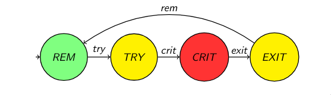

# Sincronización entre Procesos

## Siempre los mismos problemas

En muchas áreas de la computación hay problemas clásicos. Eso significa que aparecen un sinfín de veces bajo diferentes formas o apariencias, pero en esencia son los mismos problemas.

En el caso de la sincronización entre procesos también sucede que muchos de estos problemas nos suelen inducir a "soluciones" incorrectas.

## Turnos

Tenemos una serie de procesos ejecutando en simultáneo:

$$
P_i, \quad i \in [0 \dots N-1]
$$

* Cada proceso $P_i$ ejecuta una tarea $s_i$. Supongamos que consiste en imprimir: "Soy el proceso $i$".
* Qué queremos:
  * **Sí queremos:** Soy el proceso 0. ... Soy el proceso N-1.
  * **No queremos:** Soy el proceso 2. Soy el proceso 1. ... Soy el proceso N-1.

La mejor solución aquí es utilizar semáforos. Vamos con un pseudocódigo:

```c
semaphore sem[N+1];

proc init() {
  for (int i = 0; i < N+1; i++) {
    sem[i] = 0;
  }

  for (int i = 0; i < N + 1; i++) {
    spawn P(i);
  }

  sem[0].signal();
}

proc P(int i) {
  sem[i].wait();
  printf("Soy el proceso %d\n", i);
  sem[i+1].signal();
}
```

Ahora la pregunta del millón: ¿es correcto este programa?

## Razonamiento en paralelo

En el caso de los programas en paralelo, la noción de "correcto" deja de ser unívoca para transformarse en un conjunto de propiedades que se plantean sobre toda la ejecución.

La manera de lidiar con la corrección de este tipo de sistemas suele ser:

* Plantear propiedades de **safety** (seguridad): que cosas malas, como los **deadlocks**, no sucedan.
* Plantear propiedades de **progreso** (o **liveness**): que las cosas buenas eventualmente pasen.

## Tipos de propiedades

Un contraejemplo común para demostrar que no se cumple alguna de las propiedades es dar una sucesión de pasos que muestre una ejecución del sistema que viola cierta propiedad.

### 1. Safety (Seguridad)
Garantiza que **"nada malo sucederá"** durante la ejecución. Si esta propiedad se viola, el error ocurre en un instante específico de la ejecución y es irremediable.
* **Ejemplos:** Exclusión mutua (evitar que dos procesos entren a la misma sección crítica al mismo tiempo), evitar deadlocks, seguridad de memoria.

### 2. Liveness (Progreso)
Hace referencia al conjunto de propiedades que un sistema debe satisfacer para garantizar que los procesos **avancen** en el tiempo (que "algo bueno eventualmente pase"). 
* **Fallas de liveness:** Ciclos infinitos, espera activa (*busy wait*), inanición (*starvation*). Por lo general, se caracterizan por un bajo rendimiento y pobre capacidad de respuesta.

### 3. Fairness (Equidad)
La intuición de esta propiedad es que los procesos reciban su turno con infinita frecuencia.
* **Incondicional:** El proceso es ejecutado "regularmente" si está habilitado siempre.
* **Fuerte:** El proceso es ejecutado "regularmente" si está continuamente habilitado con infinita frecuencia.
* **Débil:** El proceso es ejecutado "regularmente" si está continuamente habilitado a partir de determinado momento.

---

## Volvemos a turnos

Ahora, con nuestras nuevas herramientas, podemos argumentar si la solución propuesta es correcta.

Primero formalicemos. Tenemos una serie de procesos ejecutando en simultáneo $P_i, i \in [0 \dots N-1]$ y cada proceso ejecuta una tarea $s_i$. Debemos asegurar la siguiente propiedad: las tareas $s_i$ se ejecutan en estricto orden: $s_0, s_1, \dots, s_{N-1}$.

### Demostración por el absurdo (Safety)

Supongamos que **no** se cumple la propiedad de orden. Esto implica que existen por lo menos dos índices $j, k \in [0 \dots N-1]$ tales que $k > j$, pero la tarea $s_k$ se ejecuta antes que la tarea $s_j$.

1. Para que el proceso $P_k$ pueda ejecutar su tarea $s_k$, primero debe superar con éxito la instrucción `sem[k].wait()`.
2. Esto significa que el valor del semáforo `sem[k]` debió ser mayor a 0 en ese instante.
3. Al observar el código, la única instrucción que puede incrementar `sem[k]` es `sem[k].signal()`, la cual es ejecutada exclusivamente por el proceso anterior $P_{k-1}$.
4. Dicha señal solo se envía **después** de que $P_{k-1}$ haya completado su propia tarea $s_{k-1}$. Por lo tanto, existe una dependencia causal: $s_{k-1}$ ocurre antes que $s_k$.
5. Aplicando este razonamiento de forma inductiva hacia atrás, para que $s_k$ ocurra, debieron ocurrir $s_{k-1}, s_{k-2}, \dots, s_{j+1}$ y, finalmente, $s_j$.

**Conclusión:** Hemos demostrado que $s_j$ debe ocurrir necesariamente antes que $s_k$. Esto contradice nuestra suposición inicial de que $s_k$ se ejecutaba antes que $s_j$. Al llegar a una contradicción, la premisa de que el orden puede violarse es falsa. Por lo tanto, la solución cumple con la propiedad de orden establecida.

---

## Rendezvous

Rendezvous (punto de encuentro) o barrera de sincronización es el siguiente problema:

Cada $P_i \in [0 \dots N-1]$ tiene que ejecutar $a(i)$ y luego $b(i)$, y se debe garantizar la propiedad de **BARRERA**:

La tarea $b(j)$ se ejecuta después de **todos** los $a(i)$.

Vamos con una solución incorrecta al problema:

```c
atomic<int> cant = 0;
semaphore barrera = 0;

proc P(i) {
  a(i);

  if (cant.getAndInc() < N-1) { 
    barrera.wait();
  } else {
    barrera.signal();
  } 
  b(i);
}
```

Notemos que esta solución no es correcta, ya que $N-1$ procesos se quedan bloqueados en la línea `barrera.wait()`. Esto sucede porque hay un único `barrera.signal()`. Este programa solo cumple la propiedad de *safety* (ningún $b(j)$ se ejecuta antes de tiempo), pero no alcanza con eso, ya que caemos en un bloqueo permanente por **deadlock** (falla de *liveness*).

---

## Modelo de proceso

Para demostrar formalmente propiedades, podemos modelar el ciclo de vida de un proceso basándonos en la formalización de Nancy Lynch (*Distributed Algorithms*):

<p align="center">
  
</p>

* **REM (Remainder):** El proceso ejecuta código local, sin interés en acceder a recursos compartidos. Corresponde a la sección restante.
* **TRY (Trying):** El proceso necesita entrar a la sección crítica y ejecuta el protocolo de entrada (espera su turno).
* **CRIT (Critical):** El proceso logró entrar y tiene acceso exclusivo al recurso compartido.
* **EXIT (Exit):** El proceso terminó de usar el recurso y ejecuta el protocolo de salida para liberar a otros.

Formalizando matemáticamente:

* **Estado Global ($\sigma$):** Es una función que mapea cada proceso a su estado actual.
  $$\sigma : [0 \dots N-1] \to \{ REM, TRY, CRIT, EXIT \}$$
* **Transición ($\xrightarrow{\ell}$):** Define cómo el sistema pasa de un estado a otro mediante una acción $\ell$.
  $$\sigma \xrightarrow{\ell} \sigma', \quad \ell \in \{rem, try, crit, exit\}$$
* **Ejecución ($\tau$):** Es la secuencia infinita de estados y transiciones que describen el historial del sistema.
  $$\tau = \sigma_0 \xrightarrow{\ell} \sigma_1 \xrightarrow{\ell} \sigma_2 \dots$$

## WAIT-FREEDOM

Todo proceso que intenta acceder a la sección crítica, en algún momento lo logra, cada vez que lo intenta. A esta propiedad se la llama **WAIT-FREEDOM**:

$$
\forall \tau. \forall k. \forall i. \tau_k(i) = TRY \Rightarrow \exists k' > k. \tau_{k'}(i) = CRIT
$$

En palabras simples, el sistema te garantiza matemáticamente que, en algún momento finito, vas a tener el recurso disponible. Nadie se queda tocando la puerta para siempre.

## Rendezvous: solución

La solución para este problema es sacar el `else` de la solución original:

```c
atomic<int> cant = 0;
semaphore barrera = 0;

proc P(i) {
  a(i);
  
  if (cant.getAndInc() < N-1) {
    barrera.wait();
  }
  
  barrera.signal();
  
  b(i);
}
```

## Formalizando 

El modelo de Lynch puede ayudar a formalizar algunas propiedades:

* **FAIRNESS:** Para toda ejecución $\tau$ y todo proceso $i$, si $i$ puede hacer una transición $\ell_i$ en una cantidad infinita de estados de $\tau$, entonces existe un $k$ tal que $\tau_k \xrightarrow{\ell_i} \tau_{k+1}$.
* **Exclusión mutua:** Para toda ejecución $\tau$ y estado $\tau_k$, no puede haber más de un proceso $i$ tal que $\tau_k(i) = CRIT$.
* **Progreso:** Para toda ejecución $\tau$ y estado $\tau_k$, si en $\tau_k$ hay un proceso $i$ en $TRY$ y ningún $i'$ en $CRIT$, entonces $\exists j > k$ tal que en el estado $\tau_j$ algún proceso $i'$ está en $CRIT$.

Predicados auxiliares:

* **Lograr entrar:**
  Def.: $IN(i) \equiv i \in TRY \Longrightarrow \Diamond i \in CRIT$
* **Salir:**
  Def.: $OUT(i) \equiv i \in CRIT \Longrightarrow \Diamond i \in REM$

## Livelock

El primo olvidado del deadlock. Un conjunto de procesos está en **Livelock** si estos continuamente cambian su estado en respuesta a los cambios de estado de los otros, sin avanzar realmente.

A diferencia del deadlock (donde los procesos se bloquean sin hacer nada), en el Livelock los procesos están activos pero su actividad no produce progreso útil.

**Ejemplo:** Queda poco espacio en disco. El proceso A detecta la situación y notifica al proceso B (bitácora del sistema). B registra el evento en disco, disminuye el espacio libre, lo que hace que A detecte la situación nuevamente y vuelva a notificar... indefinidamente.

## Sección crítica de a M procesos (SCM)

Generalización del problema de exclusión mutua: se permite que hasta $M \leq N$ procesos estén en la sección crítica simultáneamente. La propiedad a garantizar es:

$$
1) \quad \#\{i \mid \tau_k(i) = \text{CRIT}\} \leq M \quad \forall \tau, \forall k
$$

$$
2) \quad \forall i.\ \tau_k(i) = \text{TRY} \land \#\{j \mid \tau_k(j) = \text{CRIT}\} < M \Rightarrow \exists k' > k.\ \tau_{k'}(i) = \text{CRIT}
$$

La condición 1 es de safety (no más de M en $CRIT$) y la condición 2 es la de liveness (si hay lugar, quien espera entra). La solución es directa con un semáforo inicializado en M:

```c
semaphore sem = M;

proc P(i) {
  sem.wait();
  sc(i);
  sem.signal();
}
```

Cuando $M = 1$ se recupera el problema clásico de exclusión mutua.

## Lectores/Escritores

Problema clásico en bases de datos. Hay una variable compartida con dos tipos de acceso: los **escritores** necesitan acceso exclusivo (nadie más puede leer ni escribir), pero los **lectores** pueden leer simultáneamente entre sí.

La propiedad a garantizar es **SWMR** (Single-Writer / Multiple-Readers):

$$
\forall \tau, \forall k. \exists i. writer(i) \land \tau_k(i) = CRIT \Rightarrow \forall j \neq i. \tau_k(j) \neq CRIT
$$

Es decir: si hay un escritor en $CRIT$, nadie más puede estar en $CRIT$. La segunda condición es que si hay un lector en $CRIT$, todos los demás procesos en $CRIT$ también deben ser lectores.

### Solución con 2 semáforos y un contador:

```c
semaphore wr = 1;
semaphore rd = 1;
int readers = 0;

proc writer(i) {
  wr.wait();
  write();
  wr.signal();
}

proc reader(i) {
  rd.wait();
  readers++;
  if (readers == 1) {
    wr.wait(); 
  }
  rd.signal();
  
  read();
  
  rd.wait();
  readers--;

  if (readers == 0) {
    wr.signal(); 
  }

  rd.signal();
}
```

El semáforo `rd` protege la variable `readers`. El primer lector que llega toma el semáforo `wr` bloqueando a los escritores; el último lector en salir lo libera.

### Problema: inanición de escritores

Esta solución **cumple SWMR** (safety) pero puede violar **STARVATION-FREEDOM**. Si siempre hay al menos un lector activo, los escritores nunca podrán acceder. Se dice que los lectores tienen prioridad implícita sobre los escritores.

## Filósofos que cenan

Dijkstra, 1965. Hay 5 filósofos en una mesa circular, 5 platos de fideos y un tenedor entre cada par de platos adyacentes. Para comer, cada filósofo necesita los 2 tenedores que tiene a sus lados. El ciclo de vida de cada filósofo es:

```c
proc Filosofo(i) {
  while(true) {
    pensar();            
    tomar_tenedores(i);  
    comer();             
    soltar_tenedores(i); 
  }
}
```

Las propiedades a satisfacer son:

* **EXCL-FORK:** Los tenedores son de uso exclusivo (safety).
* **WAIT-FREEDOM:** No hay deadlock (liveness).
* **STARVATION-FREEDOM:** No hay inanición (liveness).
* **EAT:** Más de un filósofo puede estar comiendo a la vez, variante de **SCM** (liveness).

### Solución naive con semáforos

```c
#define izq(i) i
#define der(i) ((i + 1) % N)
semaphore tenedores[N] = 1;

void tomar_tenedores(int i) {
  tenedores[izq(i)].wait();
  tenedores[der(i)].wait();
}

void soltar_tenedores(int i) {
  tenedores[izq(i)].signal();
  tenedores[der(i)].signal();
}
```

Esta solución cumple **EXCL-FORK** pero falla en las demás propiedades. El problema de deadlock ocurre si todos los filósofos toman su tenedor izquierdo simultáneamente: cada uno queda esperando el derecho, que está tomado por su vecino, formando un ciclo de espera infinito.

| Propiedad | ¿Se cumple? |
| :---: | :---: |
| EXCL-FORK | SÍ |
| WAIT-FREEDOM | NO |
| STARVATION-FREEDOM | NO |
| EAT | NO |

### Resultado fundamental

Según Lynch (*Distributed Algorithms*, cap. 11), no existe ninguna solución simétrica al problema de los filósofos, es decir, no existe solución en la que todos los filósofos ejecuten exactamente el mismo código sin distinguirse de alguna manera.

## El Barbero

En una peluquería hay un único peluquero y dos salas: una de espera con N sillas y otra con la única silla de corte. El comportamiento es: 

* Cuando no hay clientes, el peluquero duerme.
* Cuando entra un cliente, si no hay lugar en la sala de espera, se va; si el peluquero está dormido, lo despierta.

### Solución

Se usan 2 semáforos y un objeto atómico:

```c
semaphore un_cliente = 0;
semaphore siguiente = 0;
atomic<int> clientes = 0;

void proc Peluquero() {
  while(true) {
    un_cliente.wait();
    siguiente.signal();
    cortar_pelo();
  }
}

void proc Cliente() {
  if (clientes.getAndInc() >= N + 1) {
    clientes.getAndDec();
    return;
  }
  
  un_cliente.signal();
  siguiente.wait();
  
  hacerse_cortar_el_pelo();
  
  clientes.getAndInc();
}
```

El semáforo `un_cliente` sincroniza la llegada de un cliente con el peluquero dormido. El semáforo `siguiente` sincroniza el momento en el que el peluquero está listo para atender con el momento en el que el cliente pasa a la silla. El contador atómico `clientes` controla la capacidad de la sala de espera.

## Donde estamos

Hasta ahora vimos lo siguiente:

  - Problemas clasicos de sincronización.
  - Propiedades a garantizar.
  - Como razonar sobre programas paralelos.
